# MD5 Attack
* This readme follows this blog: [Corkami](https://www.exploit-db.com/docs/english/46047-md5-collision-of-these-2-images-is-now()-trivial-and-instant.pdf)
* 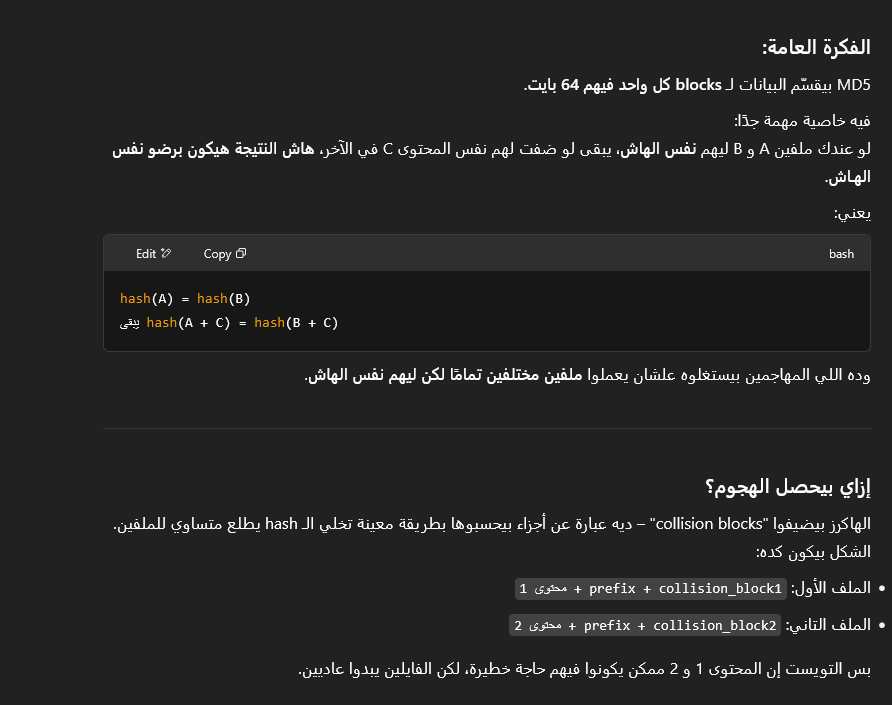
* 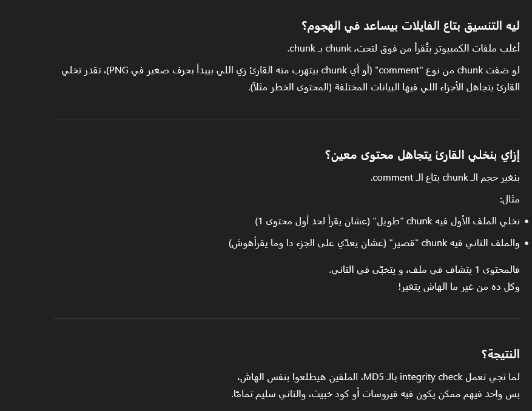

## Explaining the process overview
* 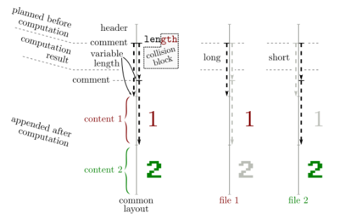
* 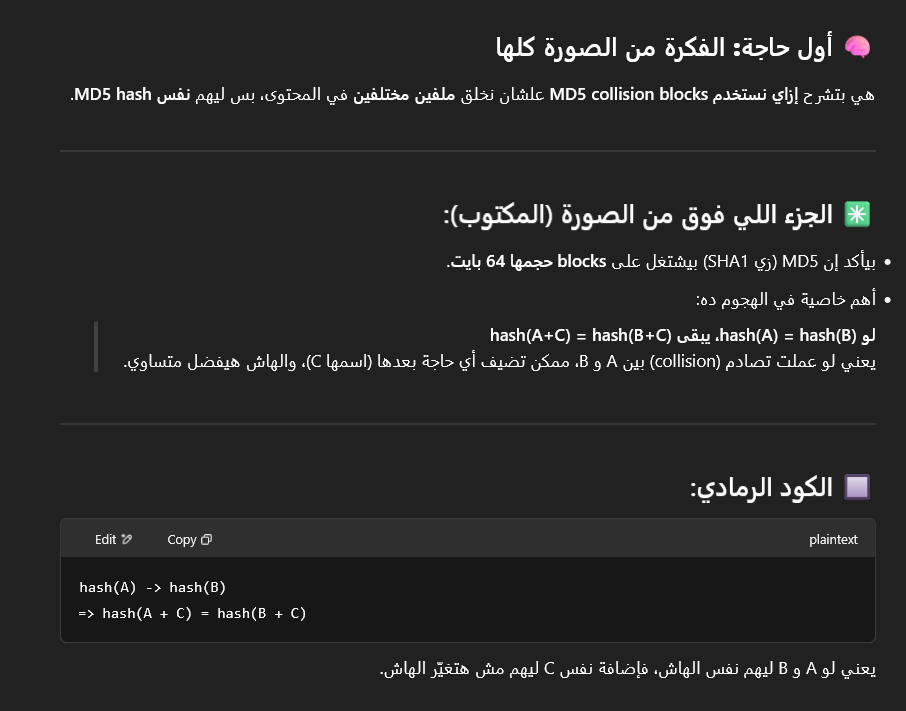
* 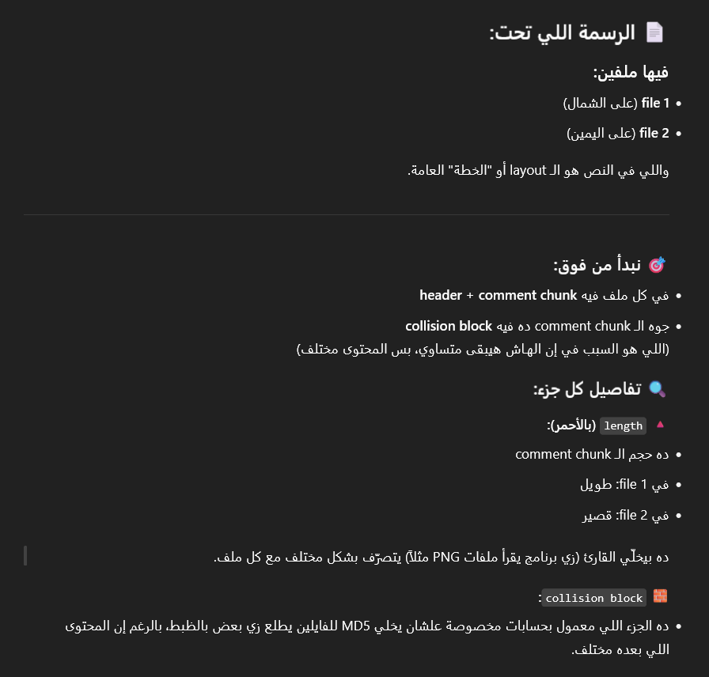
* 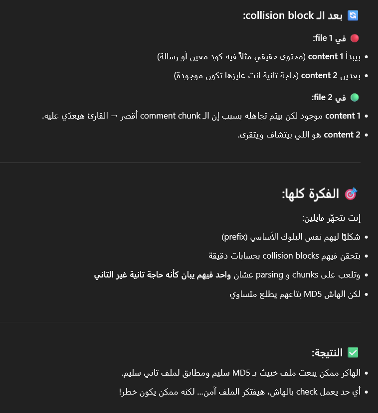

* يعني احنا بنحط المحتوي بتاع الفايلين في الملفين, و اول ملف بنخليه يظهر بس المحتوي الاول و الملف التاني  بنخليه يظهر الملف التاني, و ده بيتم باستخدام الcomment chunck و بما ان الملفين فيهم نفس المحتوي بظبط اللي هو content1 + content2 فبالتالي الhash بتاعهم هم الاتنين هيكون نفس الهاش, و بالتالي لما هنضيف ليهم هم الاتنين نفس الcomment chunk (T)  ساعتها هنحقق ان Hash(A+T) = Hash(B+T)
صح كدا؟

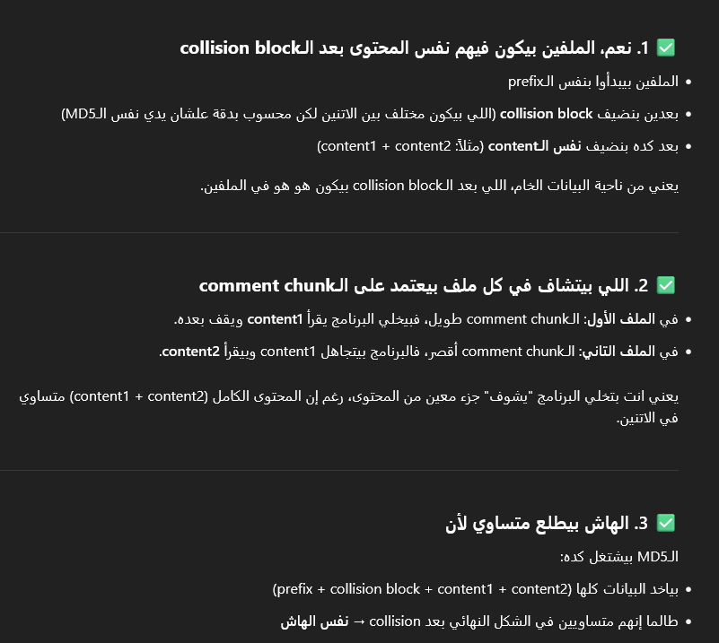

## Logical Question steps: 
1. how to compute 2 different collision blocks hashs so that they both have the same hash value
2. how to craft these 2 collision blocks
   
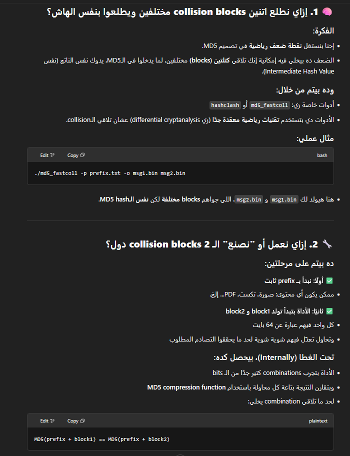

## Explaining how can we hide other data
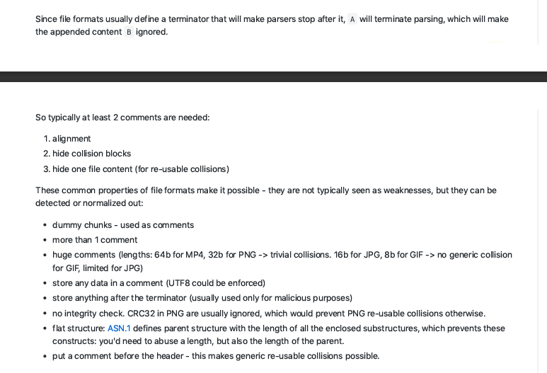

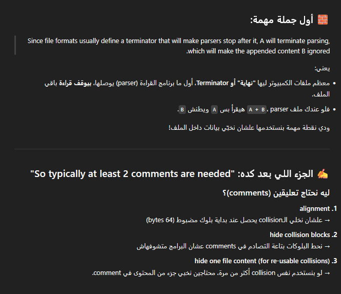

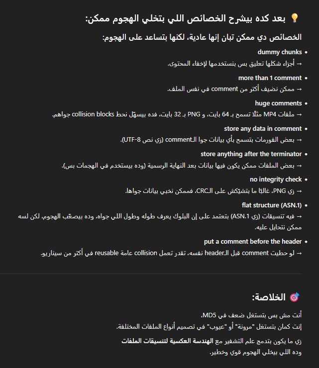

## how to craft Identical Prefix
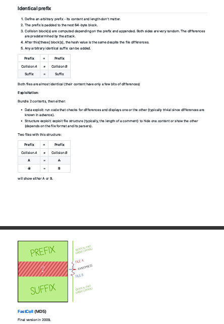

1. 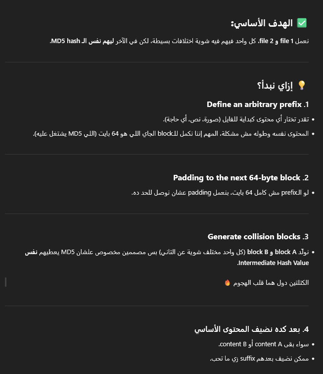
2. 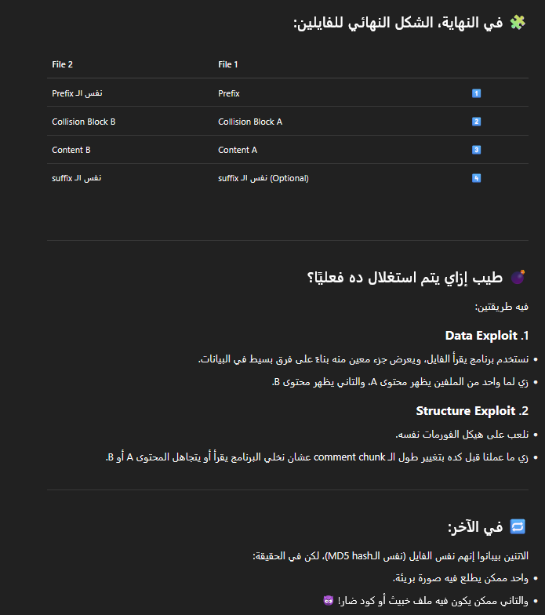
3. 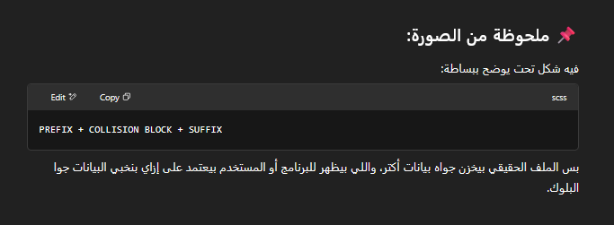

## Understanding pdf structure:
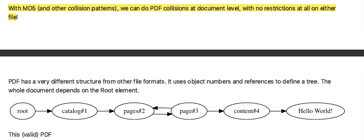

### Progress till now:
* I have successfully generated two pdfs with the same hash value, however, my issue is that the pdfs are visibally changed, and some of them has different content from the other.
* my task is to know how to generate .bin files so that I can correctly show the correct content