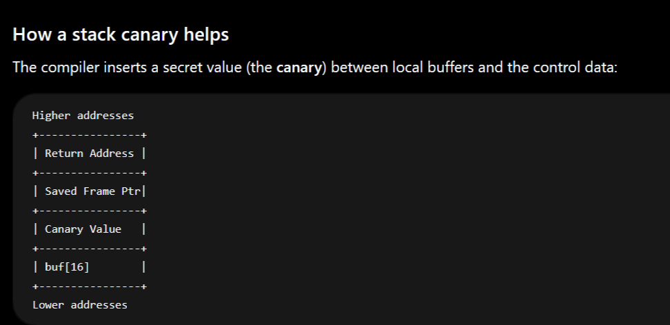
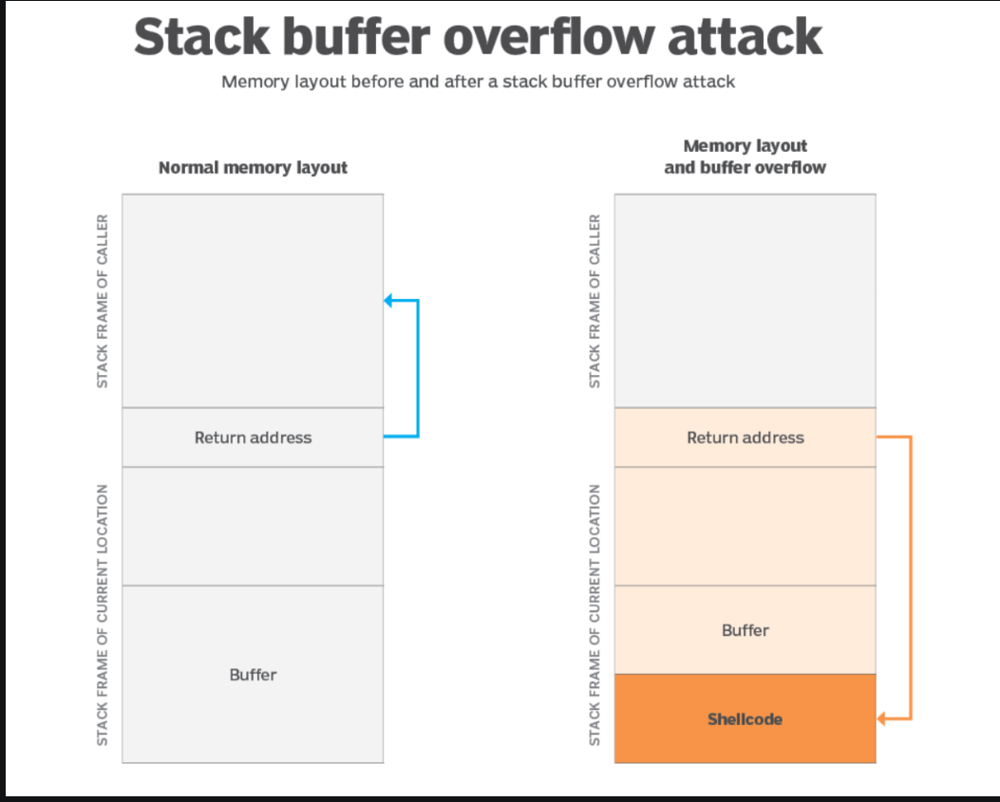
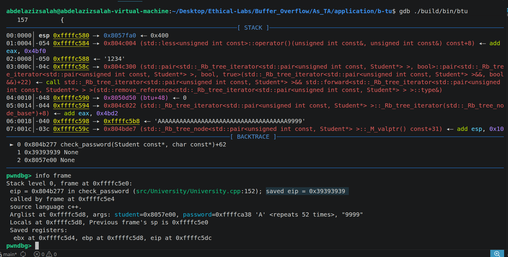
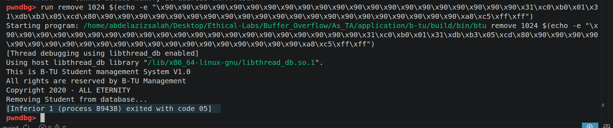
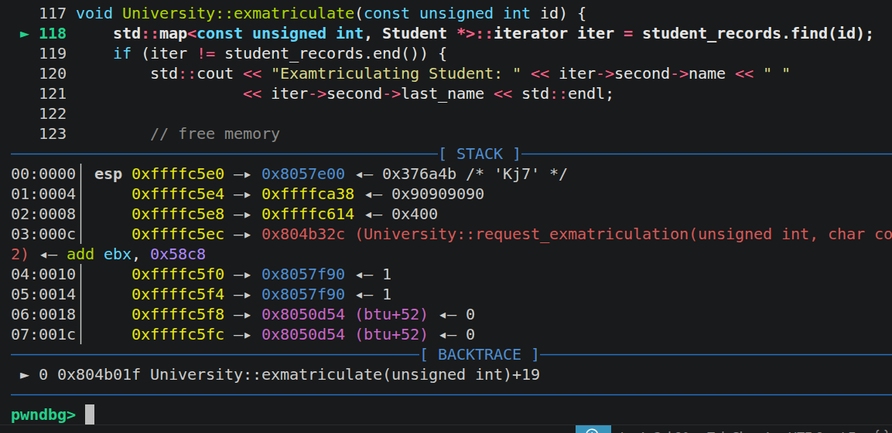
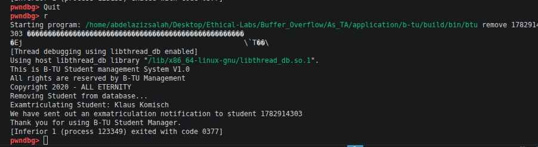
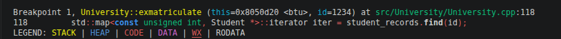
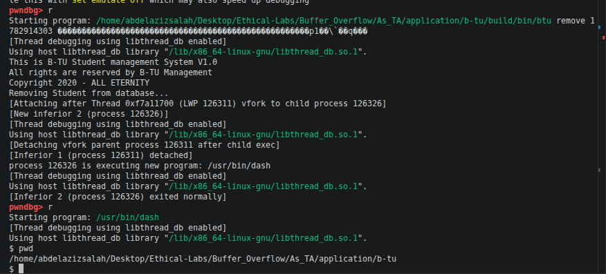
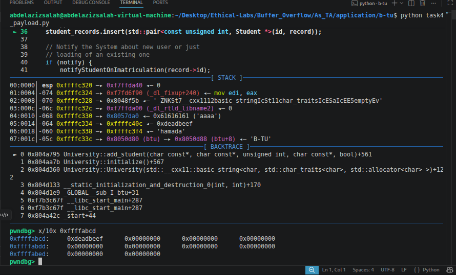
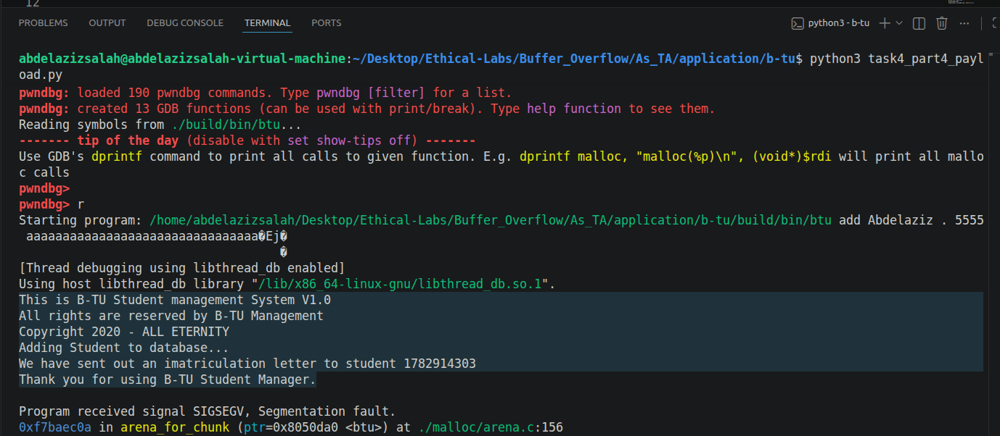

## Getting started
- What is the difference between gcc and g++ ? 
  - gcc for compiling c codes.
  - g++ for compiling c++ codes. 
- gdb is for debugging c and assembly code. 
- hexedit and bless are used for viewing and editing binary files. 

## What are the protection measures ?
- ASLR: 
  - Address space layout randomization
  - This is mainly used to randomaize the starting address of the heap and the stack. 
  - This makes it difficult to determine the exact memory address of code in each running instance of the program. 
  - To disable the ASLR there are two possible ways:
      1. Disable it globally using these commands: 
          > sudo -s (Switch to root)
          > sysctl -w kernel.randomize_va_space=0 
              
          - sysctl is a utility for viewing and modifying kernel parameters. 
          - -w is write or change the parameter
          - kernel.randomize_va_space the ASLR settings. 
          - =0 disable the ASLR. 
      2. For specific programs we have 2 ways
         1. Using GDB, it will automatically be closed.
         2. Using this command:
            > setarch $(uname-m) --addr-no-randomize (program)(arguments)  
            - uname -m prints the machine architecture (This may not be necassary)
            - setarch runs a program with modified execution personality flags 
              - It says run the given program but with some modified parameters
            - --adr-no-randomize: disables ASLR for the launched process and its children.
- Canary
  - This is another name for the Stackguard
  - It is a mechanism that helps in detecting stack overflow attacks before they overwrite the function return address.
  - The canary is a placed value before the return address, so if the user modified it, the compiler detect that it has been modified, then it detects the attack, and returns falut. 
    - 
  - To disable it, we can use this command: 
     > g++ -fno-stack-protector example.c
- Non-Executable Stack (NX)
  - Executable attacks nowadays are not allowed by default.
  - So if a program wants to activate this feature, it must do that explicitly. 
    - > g++ -z execstack -o example.exe example.c
      - -z execstack tells the linker to mark the stack as executable. 
    - To reverse it, we need to use 
      - g++ -z noexecstack -o example.exe example.c
- Fortify source
  - Modern compilers optimize the code written by developers during the compilation step
  - This allows the compiler to replace common code snippts corresponds to bad programming practices, and optimize the overall performance of the program. 
  - To prevent this we use the following command:
    - > g++ -U_FORTIFY_SOURCE -o example.exe example.c
  - To activate it back:
    - > g++ -D_FORTIFY_SOURCE=1 -o example.exe example.c
- Position Independent Code
  - Programs are compiled so they can run correctly regardless of where they are loaded in memory. 
  - This is important for shared libraries and ASLR. 
  - However, because code and libraries can be loaded at different addresses each run
    -  debugging and exploit analysis become more difficult
    - Without PIE:
      - Starting address of main will always be 0x401156
    - With PIE
      - each run it will have a different address   
    -  Thus, for this case we are going to turn it off using this command:
       -  g++ -no-pie -o exmaple.exe example.c
-  How is PIE different from ASLR? 
   -  ASLR: This is the OS mechanism for randomizing memory addresses. 
   -  PIE: A way of compiling a program so that ASLR can randomize the program's code section.
   -  Example: 
      -  Without PIE
         -  if ASLR is enabled:
            -  Stack -> randomized
            -  Heap -> randomized
            -  Libraries -> randomized
            -  Program -> fixed address
               -  So the main address always start from the same location 0x401165
               -  but everything else is randomized due to ASLR
         -  But with PIE, everytime, we will have a new starting memory address location
            -  main -> 0x405325
            -  main -> 0x405535
            -  main -> 0x135645

## Understanding the content of the MakeFile
- The Make file is important, but the most important line in it is the CXXFLAGS
  - CXX is the compiler -> g++ in our case
  - CXXFLAGS: 
    - -m23: 32-bit executable, it is easier to learn and used for classic buffer overflow techniques.
    - -Wall: enable all common warnings by the compiler
    - -Wextra: Enable more warnings. 
    - -Werror: Treat warnings as errors
    - -U_FORTIFY_SOURCE: Disable source code optimzation
    - -z execstack: makes the stack executable by default
    - -fno-stack-protector: turn off canary protection
    - -no-pie: makes the starting address static for the main function. 
- For the debug option we just add -DDEBUG and -g

## The main goal of the lab:
- The main goal is to withdraw a BTU student without knowing his associated password.
- We have access to the BTU command line only, and we assume that we do not have access to the database. 

## Task1 steps
- Trail and error approach
  - We run the program, and keep sending different inputs until we find the input length that cause the program to crash
  - So, he should show a script that does this, and show how he knows that the system crashed?
    - No print of we sent immerticulation to student ...
  - He should show both of them in Add and Remove functions.
- Then he should show them in the code
  - In BTU.cpp, at line 60, we can see that add_student function takes the arguments with not proper validation on the inputs.
  - Going to University.cpp, in line 31, we can find that it uses directly strcpy on the given input **password** without any proper check, and since password is defined to be a fixed size array of length 32, then here is the problem.
  - For remove function, we can find request_exmatriculaiton, which calls check_password, in the check_password, there is the same exact problem, they use strcpy to copy the user input without any proper validation in a fixed size array.

## Task2 steps
- In this stage we need to exploit simple buffer overflow, by sending exploit to the functions, and execute exit function with code 5. 
- First we need to be able to craft the payload. 
- In order to do so, we need to first understand the structure of the memory layout
  - 
  - First we have the stack frame of the caller.
  - Then we have the Return address.
  - Then we have some parameters in between. (Or padding)
  - Then the buffer (We know in our case that it has length 32 bytes)
- Our idea will be to fill the buffer, until we can overwrite the return address
- Then we modify the return address to the location of our shell code in the memory
- So that the return pointer will point to our shellcode.
- Then once it jumps there, it should execute our exit function. 
  - Important addresses:
    - The register which stores the return address is located at the frame starting address, in my case now it is 0xffffc5e0
    - The vulnerable buffer, is the password puffer, and we can get it using &lhs, in my case now it is 0xffffc5a8
      - lhs because this is its name in the code
    - So we can conclude now that the distance between the buffer which is vulnerable and the return address is:
      - e0 - a8 in hex = 0x38 which is 56 in decimal. 
      - We know that the buffer itself is 32. 
      - Then this mean that there are 56 - 32 - 4 = 20 padding bytes, and 4 bytes for the return address
      - So our payload should be 
        - 52 dummy values + 4 values for the desired address
        - 
          - We need to make **n** in the debugger until it copies the user input in the password buffer. 
      - Now, after we managed to prove that we can change the return address, we need to add nop sleds, then we add our payload. And the address should be the begining of our buffer &lhs. 
      - But it must be built in the little endian format
        - Run the gdb
        - run remove 1024 $(echo -e "\x90\x90\x90\x90\x90\x90\x90\x90\x90\x90\x90\x90\x90\x90\x90\x90\x90\x90\x90\x90\x90\x31\xc0\xb0\x01\x31\xdb\xb3\x05\xcd\x80\x90\x90\x90\x90\x90\x90\x90\x90\x90\x90\x90\x90\x90\x90\x90\x90\x90\x90\x90\x90\x90\x38\xc8\xff\xff")
          - 
## Task3 
- The main goal here is to call the exmatriculate function and send it the parameters of Klaus Komisch.
- Here we do not need to add malicious code in the stack to be executed, instead, we just need to modify the return address to be the address of the exmatriculate function, and to provide the correct parameters, and then we can bypass the password and kick this user out. 
- The main idea now that the attacker needs to find a code that is already in the memory, and gets its address, then he can change the eip pointer towards it. 
- There is a region in the memory where a plenty of code can be found. This is the region for the standard C library functions, this is called libc in Linux, which is a dynamic link library. 
- Before the program run, usually the OS loads this libc in the memory.
- The question becomes if there is a function in the libc that can achieve our main goal
- This function is usually system(), which takes a string as its argument, treats the string as a command, and executes the command, so we can use it later for executing the shell.
- So first part will be to exmatriculate the student, then the second part will be to call system and initiate a shell. 

### Task3.1; exmatriculation
1. Find the address of the exmatriculate function
   - b exmatriculate
     -  in my case it is: 0x804b01f
2. Using the same code as before, we just need to modify the return address   
   1. run remove 1024 $(echo -e "\x90\x90\x90\x90\x90\x90\x90\x90\x90\x90\x90\x90\x90\x90\x90\x90\x90\x90\x90\x90\x90\x31\xc0\xb0\x01\x31\xdb\xb3\x05\xcd\x80\x90\x90\x90\x90\x90\x90\x90\x90\x90\x90\x90\x90\x90\x90\x90\x90\x90\x90\x90\x90\x90\x1f\xb0\x04\x08")
   2. 
3. Now the problem is with the id, we need to pass the correct ID. To solve this issue, we must understand the structure of the stack at this point.
   - payload
   - return address of the exmatriculate function 0x804b01f
   - dummy return address after it finishes the excution (We should use the address of the exit function to make it exit safely, in this case: 0xf7b55460). 
   - the parameters which should be the ID in this case.  
     - To know the address of BTU -> p &btu = 0x8050d20
     - To know the address of the student ->p &id = 0xffffc614
   - Now we can build the payload
   - yload as follows: 
     - dummy data
     - exmatriculate
     - exit address
     - BTU address
     - id address
   - After execution
     - 
- Very interesting question
  - Why do we need to add the BTU address object, as the function takes only as parameter the student ID? 
    - This is because we call the function from the university object, so even if we do not explicitly send the university object in the parameters, it is sent implicitly
      - 
    - While finding the address of exmatriculation, you must use disassemble, and use the address which include push ebp, because if you didn't store the base pointer correctly, you will end up corrupting the memory and you will not return correctly. 

### Task 3.2: Shell
- Same idea, all we need to modify here is the address of the function, and to utilize the correct parameters
- For the system function address, we can get it using:
  - p &system
- For the /bin/bash, we need first to add it to the enviroment variables
  - export /bin/bash
- Then look for its address in the memory using the gdb.
- Then finally we build the payload:
  - dummy data + system address + exit address + bin bash address
  - 

### Task4 is easy

- The main idea of Task4 is to overwrite only the return address, without modifing any other regions, so that the attack can work :).
- Finishing Task4.4
  - 