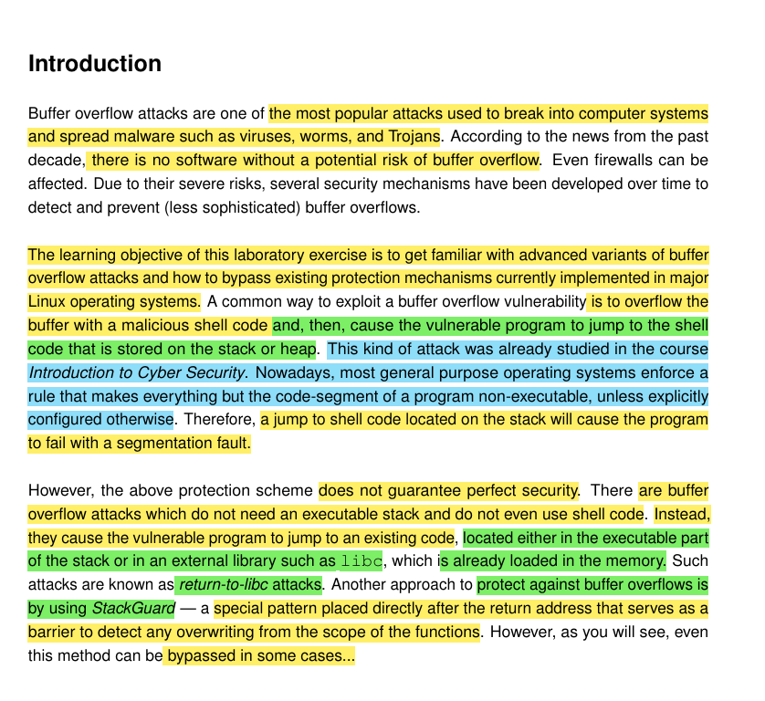
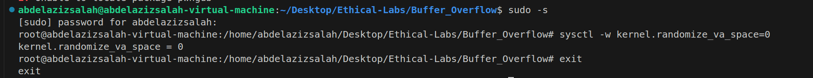
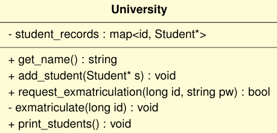
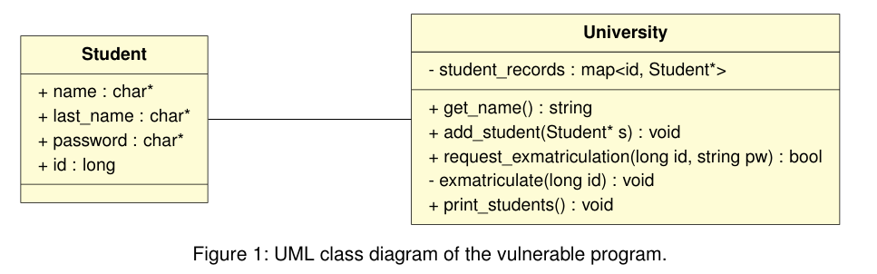
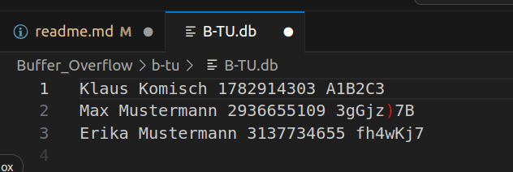
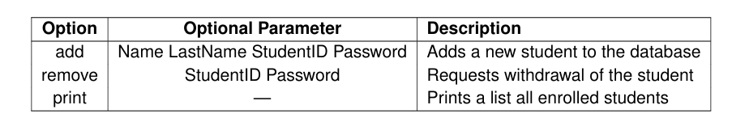
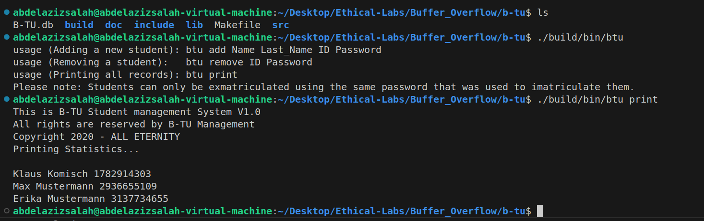

| Name              | Date       | Description                                      |
|-------------------|------------|--------------------------------------------------|
| Abdelaziz Nematallah | 2025-05-18 | Write-up for Buffer overflow Lab |
# Advanced Buffer Over Flow Lab: 
* 

## Necessary Software for the Lab: 
1. first of all we will need gcc and g++ for 32-bit C/C++ to be able to compile our c program, so to install it we should excute the following commands: 
    > sudo apt install -y gcc-multilib

    > sudo apt install -y g++-multilib
2. gdb to be able to run a program in the debugging mode. 
    > sudp apt install -y gdb
3. pwndbg is useful for features like: 
    1. Better register display
    2. Heap inspection
    3. Symbol/ROP utils
    * to install it use the following commands: 
    > cd ~
    
    > git clone https://github.com/pwndbg/pwndbg
    
    > cd pwndbg
    
    > ./setup.sh
4. hex editors to view binary files: 
    > sudo apt -y install hexedit

    > sudo apt -y install bless

## Disabling Existing Security Mechanisms
* Common Linux distributions have several security mechanisms implemented to make buffer overflow attacks diffcult, so to simplify our task we will disable some of them. 
* KEEP IN MIND THAT WE MAY NEED TO PLAY AROUND WITH THESE FLAGS IN THE PROVIDED **MAKEFILE** AT SOME POINT, WE WILL NEED TO MODIFY THE CXXFLAGS VARIABLE ACCORDINGLY

### Address Space Layout Randomization (ASLR): 
* this is mainly used to randomize the starting address of the heap and the stack. this makes it diffcult to determine the exact memory address of code in each running instance of the program.
* determination of addresses is an importan step of buffer overflow attacks.
* so there are 2 main ways to disable **ASLR** 
    1. one for the system as whole
    2. other applies for specific execution of a program
1. if you are running in a virtual machine **(like my case)** then it would be safe to disable ASLR globally using the following commands: 
    > sudo -s 
    Password: (enter your root password)

    > sysctl -w kernel.randomize_va_space=0

    > exit

* you can see the result below in the screenshot: 
    * 

2.  If you are working on the tasks directly on your personal computer, it may not be a good idea to
 disable ASLR for all of the processes running on your computer. In this case, there are two ways
 you can avoid ASLR: For one, ASLR is automatically disabled when running a program using GDB.
 In this case, you do not need to worry about ASLR unless you want to explicitly enable it. On the
 other hand, if for some reason you want to disable ASLR for a process that you are running without
 GDB, you can do so with the following command:
 
  >  setarch $(uname-m)--addr-no-randomize (program) (arguments)

### StackGuard Protection Scheme (CANARY): 
* The compiler g++ also implements a security mechanism called **StackGuard** that is also used to prevent simple buffer overflows. 
* we can disable it by compiling our program using the option: **-fno-stack-protector**.
* so for example if we want to compile a program called **example.c** we should run the following command: 
    > g++ -fno-stack-protector example.c

### Non-Executable Stack (NX): 
* Excutable Stacks nowadays are not allowed by default. 
* So if a program want to do so, it must explicitly declare this in the header of the program
* Then the kernel uses this mark to decide whether to make the stack of the program excutable or not. 
* when you use **g++** it by default prevent Executable Stacks, so to allow them we need to use this flag:
    > g++ -z execstack -o example.exe example.c
* this will allow the program to have excutable stack.
* to disable it again you can use this command: 
    > g++ -z execstack -o example.exe example.c

### Fortify Source
* Typically modern compilers optimize the code written by developers during compilation step.
* Which allows the compiler to replace common code snippts corresponds to bad programming practices, and optimize the overall performance of the program. 
* for example if the user uses the function **strcpy()** then the compiler will detect this and replace it with more secure version that additionally applies boundry check. 
* in this lab we want to prevent this, because we are studying these vulnerable functions.
* So, in order to disable this, we should use the fortify source flag as follows: 
    > g++ -U_FORTIFY_SOURCE -o example.exe example.c
* to activate it back we can set a value to -D_FORTIFY_SOURCE=1 or 2 for more optimization. 

### Position Independent Code (PIE / PIC): 
* Nowadays, pieces of codes are compiled in such a way that thier binaries can be excuted without any dependence on  the position they are stored in memory at. 
* This is very important feature considering dynamic libraries loaded only at run-time. 
* However, independence of position can lead to surprising  side effects when dealing with **buffer overflows** and can make the software analysis more difficult. 
* So we would like also to deactivate this feature using the following command: 
    > g++ -no-pie -o example.exe example.c

## Studying the Vulnerable Program
* We consider a c++ program which is used to manage a database of students at a university. 
* The students are represented by a **struct** called **Student**
* Consider the following code: 
```c 
struct Student { 
     / * *
    * Password used to log in at University . The students
    * passwords are allowed to be up to MAX_PASSWORD_LENGTH
    * characters .
    * /
    char password[MAX_PASSWORD_LENGTH];
    / * *
    * Students identification number.
    * /
    long id ;
    / * *
    * Last Name of the Student.
    * /
    char* last_name;
    / * *
    * Name of the Student.
    */
    char* name;
}

```

* This student belongs to a university which is represented also by another class called **University**, you can find its code at **Buffer_Overflow/b-tu/src/University/University.cpp**
    * 
* Each University offers operations as shown in the following UML diagram: 
    * 
* University stores all enrolled students in a file called **University-Name.db** so in our case it is **B-TU.db** you can found it at: **Buffer_Overflow/b-tu/B-TU.db**
* If you opened it you can see the following: 
    * 
* it has the following structure: 
    1. Student_First_Name
    2. Student_Last_Name 
    3. Student_ID
    4. Student Password -> in plaintext, because hash values would have much longer length, and all of them must have the same length also, which is not the case here -> not the best practice, but this is not the point now. 
    5. the data are separated by white spaces. 
* To make use of the classes described above, we created a source file called **BTU.cpp** you can find it at **Buffer_Overflow/b-tu/src/BTU.cpp**, it acts as a simple command line interface. 
* It offers 3 main functions: 
    * 

### Usage of provided Make file
* To build an executable, you will find a provided **MakeFile** that supports 3 main options: 
    1. clean
    2. debug
    3. release
* **Note That:** for some tasks this file needs to be modified to activate or deactivate specific security features. 
* To compile the **initial** release version from scratch, we can run the following commands: 
    > cd b-tu

    > make clean

    > make release
* after executing the above commands you can run the program which will be found at **/build/bin/btu**
    * 

* you should execute it as follows: 
    > ./build/bin/btu (options)

* during the process of exploiting we should adapt our Makefile accordingly to enable or disable the stack protections schemes mentioned above. 

* So it is mandatory to understand the content of the Makefile, and it is also recommended to understand the code in all provided files before you start. 

## What is our main goal ? 
* To know if we were successful or not, we need to withdraw one of the BTU students without knowing his/her associated password exploiting **request_exmatriculation(id, passwd)**. 
* We assume that we do have niether read nor write access to the database.
* However, we have full access to the BTU command line interface.
* So the basic idea is to exploit a buffer overflow vulnerability to circumvene the password restiriction of the program. 
* So, since the source code is given you need to navigate it, and check if you can know where is the vulnerability. 

* **Important Note:**  For your exploit development, it is sufficient that all the implemented attacks run inside a program instance that has been launched through gdb. Outside of gdb, the memory addresses needed
 for the exploit will differ slightly from those observed in the gdb session. Although there are ways
 to work around this slight issue, it adds additional complexity and time requirements to the task,
 which we want to avoid here