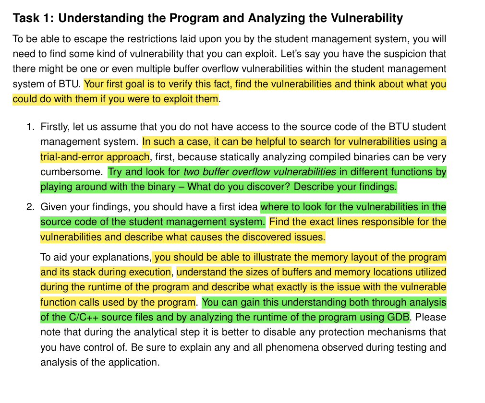
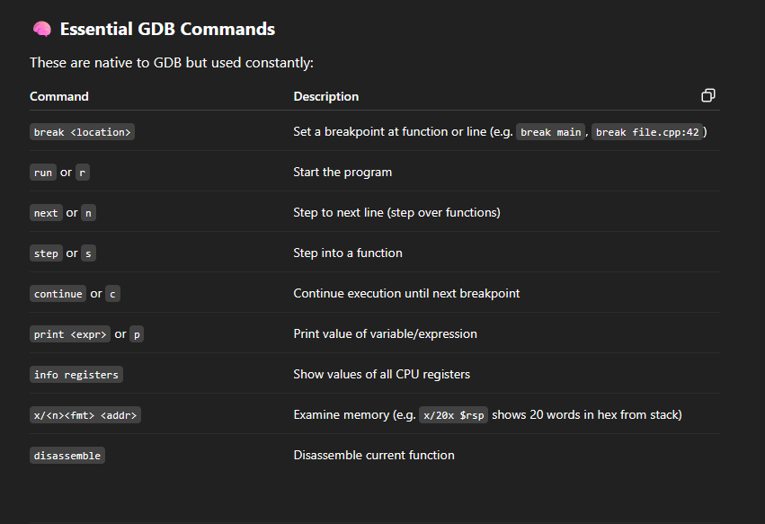
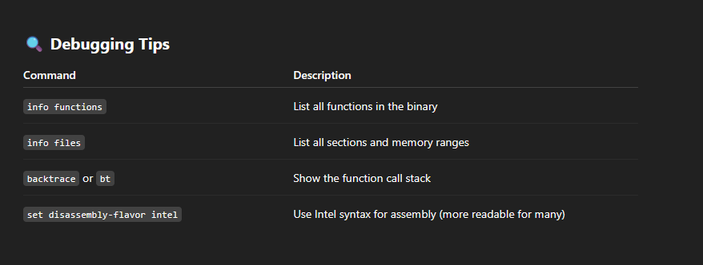
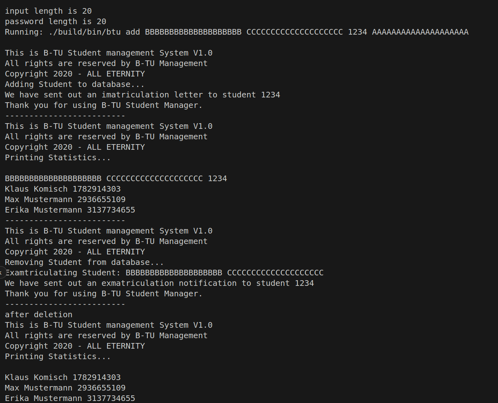
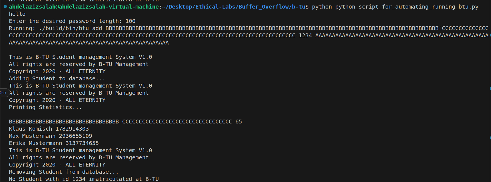
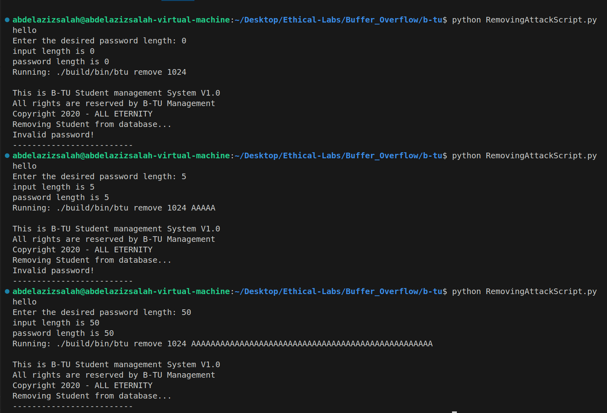

# Tasks Solutions steps: 
* After we Finished the setup of the Lab, and installed the important libraries, and understood the code existing, now its time to start going through the Tasks one by one.

## Task 1: Understanding the Program and Analyzing the Vulnerability
* 
* Task 1 has two sub tasks we need to analyze: 
    1. assume that you do not have access to the BTU Student Code (which is not our case because we already have Student.cpp), we will need in this case to run the program and keep tring different input values, and **that is what is meant by trial-and-error approach** until you can find the length of the input which can cause the program to crash. In this case we need to find 2 vulnerabilities in different functions, which will be used in the next sub-task, but we first need to describe our finding. 
    2. After we get our findings, we should go through the code look for the parts of the code which are vulnerable, in other words we need to find the exact lines responsible for vulnerabilities and describe what causes the discovered issues. 

### How to use pwndbg:
* To be able to use pwndbg, you first need to compile the program with the debug flag, which we can find in the **MakeFile** using this command:
    > make debug. 
* and here is a list of the important commands we may need during the usage of the debugger. 
    * 
    * 
    * 

### Back to the program Task 1.1:
1. the first step is always to try to run the program in the normal behaviour and check if it works properly, and here is a screenshot using the 3 provided interfaces:
    * 
2. now lets try to create a python script which insert inputs with my defined input length:
    ``` python
    import subprocess

    def run_btu_with_custom_password():
        try:
            length = int(input("Enter the desired password length: "))
            if length <= 0:
                print("Password length must be a positive integer.")
                return
            print(f'input length is {length}')
            password = 'A' * length
            firstName = 'B' * length
            LastName = 'C' * length

            print(f'password length is {len(password)}')
            
            command = ['./build/bin/btu', 'add', firstName, LastName, '1234', password]

            print(f"Running: {' '.join(command)}\n")
            subprocess.run(command)
            print('-------------------------')
            subprocess.run(['./build/bin/btu', 'print'])

            print('-------------------------')
            subprocess.run(['./build/bin/btu', 'remove', '1234', password])
            

            print('-------------------------')
            print('after deletion')
            subprocess.run(['./build/bin/btu', 'print'])
        except ValueError:
            print("Please enter a valid integer.")
        except FileNotFoundError:
            print("Error: btu binary not found. Make sure it's compiled and in the correct path.")
        except Exception as e:
            print(f"Unexpected error: {e}")

    if __name__ == "__main__":
        print('hello')
        run_btu_with_custom_password()

    ```

    * lets see different input length result: 
        1. len = 20
            - 
        2. len = 40
            * 
            * HERE WE CAN SEE SOMETHING INTERESTING
            * we can see that the add process crashes if the length was 40
            * so our target will be to try to find what is the exact length after which the system crashes. 
            * by try and error we will find it 33
3. Now lets check the second intersting interface which is remove user, so with small modification on the above python script we can create another one.
    * main logic will be to try to use wrong password, zero-length password, and very long password, and check what will happen in both cases
    ``` python
        import subprocess

    def run_btu_with_custom_password():
        try:
            uid = '1024'
            length = int(input("Enter the desired password length: "))
            
            print(f'input length is {length}')
            password = 'A' * length

            print(f'password length is {len(password)}')
            
            command = ['./build/bin/btu', 'remove', uid, password]

            print(f"Running: {' '.join(command)}\n")
            subprocess.run(command)
            print('-------------------------')
        except ValueError:
            print("Please enter a valid integer.")
        except FileNotFoundError:
            print("Error: btu binary not found. Make sure it's compiled and in the correct path.")
        except Exception as e:
            print(f"Unexpected error: {e}")

    if __name__ == "__main__":
        print('hello')
        run_btu_with_custom_password()


    ```
    * now lets try the three different cases: 
        - 
    * so we can see that there is also another issue here regarding the length, when it is so large, the system crashes.

> as conclusion using trial and error approach we found the two main vulnerabilities of the system which exist one in the add process, and the other is in the remove process which happens when the length is so large. 

### Task 1.2: Given our findings, lets look in the code, and check where is the vulnerability. 
* now we need to go for the code and check what happens in both scenarios:

#### 1. Add process
* lets analyze what happens when we excute the add command: 
    1. in **BTU.cpp** you can find that it calls **btu.add_student** passing to it the inputs directly without performing any checks, notice that btu is an instance of **University**, so we need to go in its definition and check what is inside. 
    2. at **line 41** in **University.cpp** in the add_student function definition, you can see that it takes as one of the parameters the password as char*, and it uses strcpy to copy it into the password field of the **record**  which is a pointer to Student object, so we need to see the definition of **Student**. 
    3. in **Student.h** we can see that there is a maximum length defined called: **MAX_PASSWORD_LENGTH = 32**, and there is also a variable called password which is a static array defined with this maximum size 32. 
    4. as a conclusion, we can see that the problem occurs when we send the password length with more than 32, this will cause the buffer overflow issue.
    5. and before we investigate the second function, we can also predict that this must be the same issue there. 
#### 2. Remove process. 
1. we can see that it excutes the **btu.request_exmatriculation(std::stoul(argv[2], nullptr,0), argv[3]);** command also with out any filtration on the input.
2. investigating this function, we can see that calls a function called **::check_password(citer->second, password)** which compare the password of the corrosponding student with the provided ID, and the input password from the user.
3. checking the body of this function, at line 198 we can find the vulnerability. We can see that it defines a static array with length 32, and copies the input password into it, which causes the problem, because if the input password length was > 32, this will cause the buffer overflow issue. 