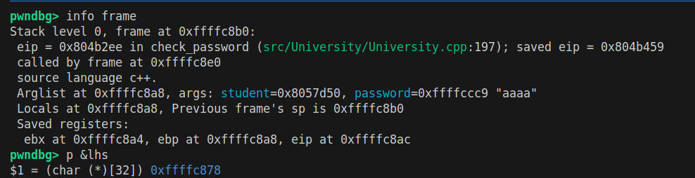
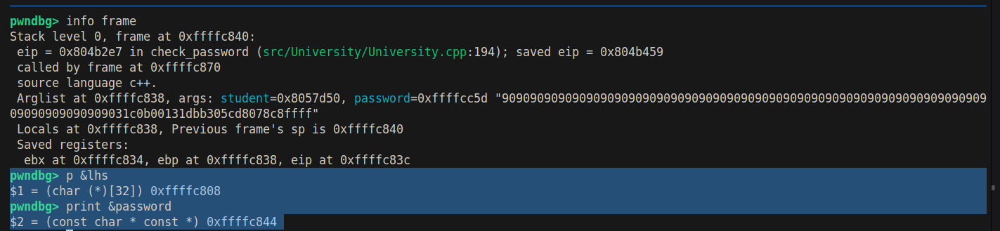

# Task2 Solution steps: 
* 
* now we need to be able to craft a payload, and the shell code is already given in hex. 
* so we know that the length of the buffer is 32, and the layout of the memory as follows: 
* 
    1. return address
    2. padding
    3. Buffer size (32 bytes)
    4. shell code which should be added. ( this part is added after the attack is made.)
* so our goal is to fill the buffer in such a way that we over write the **normal return address** and write **our address** which points at the location of the malicious code. 
* so we can run the program using gdp using the following commands: 
    > make clean 

    > make debug

    > gdb ./build/bin/btu 

* set break point at the vulnerable position in remove method
    > b check_password

* run the program and check the case of invalid password (make sure you have inserted a user with ID 1024)
    > run remove 1024 aaaaa

* now we need to check the return address and the address of the vulnerable buffer
    > info frame

    > p &lhs

* now we can see the following result: 
    - 
    - return address is **0xffffc8b0**, because from the screenshot, GDB output says that **Stack level 0, frame at 0xffffdc70** which means that the frame starts at this address, and we know that the return address is stored at the top of the stack right after the local variables and saved registers
    - the vulnerable buffer address is **0xffffc878**
    - notice that the return address after excuting the check_password is **saved eip = 0x804b459** this is before performing the buffer overflow attack, and you know that this will be our target, that we will need to change this address to make it point to the place where we have our shell code. 
    - this imply that we need to have b0 - 78 = 38 in hex -> 56 - 4 bytes in decimal to be able to overwrite the return address
    - notice the -4 because we want to reach the starting index of the return, while the return address itself is 4 bytes. 
    - thus our payload should be as follows in order to overwrite the return address
        > 'A' * 52 + (4 bytes address)
    - lets try and see if this will be the case
        1. on adding this payload: **AAAAAAAAAAAAAAAAAAAAAAAAAAAAAAAAAAAA9999**
        2. before the payload is copied into the buffer this was the info: 
            - 
        3. after the payload is copied into the buffer this is the info; 
            - 
        4. and we know that 0x39 is the hex representation of the ASCII of the char 9, this mean that we have successfully overwritten the return address with dummy address.
    - now the task will be to over write this address with meaningful address in which we store our mal code
    - using the **NOP Sled**, our payload should be the following: 
        > 42 * 0x90 + "x31 xc0 xb0 x01 x31 xdb xb3 x05 xcd x80" + return address to the begining of our buffer.
    - so I should try the following and lets see what will happen: 
        > 42 * 0x90 + "x31 xc0 xb0 x01 x31 xdb xb3 x05 xcd x80" + 0xffffc878
    - building it in little indian formate: 
        > 90909090909090909090909090909090909090909090909090909090909090909090909090909090909031c0b00131dbb305cd8078c8ffff
    - on running the second trial I found that the address of the lhs array changed, and this mean that we will not be able to fix its address in our payload, so we need to find another buffer whose address will remain the same, so I checked the variable password, and I found that its address remains the same for the whole program, and that is becase we turned off the **ASLR**
        - 
    - thus our address should be modified to be ffffc844, therefor this should be our payload: 
        > 90909090909090909090909090909090909090909090909090909090909090909090909090909090909031c0b00131dbb305cd8044c8ffff
    - now we will find another issue that our input is treated as string not hex, and this is an issue, to solve it we need to create a file containing our payload, and then load it to gdb.
        > 