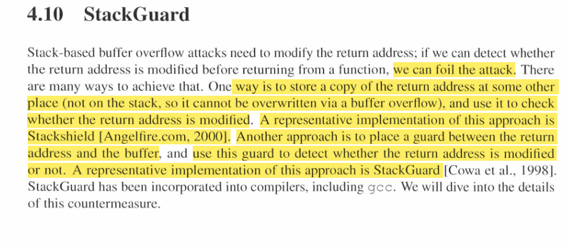
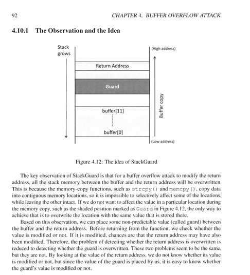

# Defeating Stack Gaurd

* If we do not want to affect the value in a particular location during 
the memory copy, such as the shaded position marked as Guard in Figure 4. 12, the only way to 
achieve that is to overwrite the location with the same value that is stored there
* Based on this observation, we can place some non-predictable value (called guard) between 
the buffer and the return address. Before returning from the function, we check whether the 
value is modified or not. If it is modi fied, chances are that the return address may have also 
been modified. Therefore, the problem of detecting whether the return address is overwritten is 
reduced to detecting whether the guard is overwritten. These two problems seem Lo be the same, 
but they are not. By looking at the value of the return address, we do not know whether its value 
is modi fied or not, but since the value of the guard is placed by us, it is easy to know whether 
the guard 's value is modified or not.