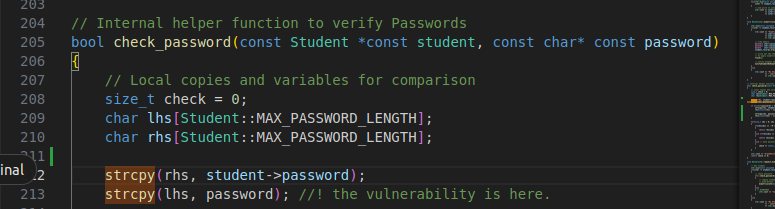
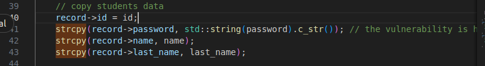
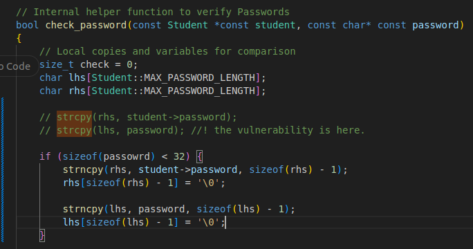
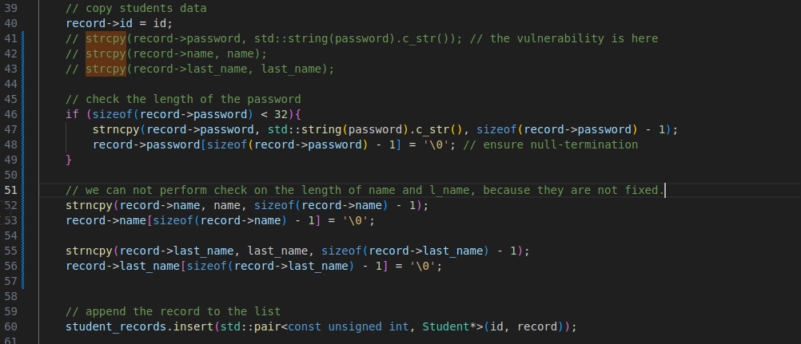

# Task5: Avoiding Buffer-Overflow Vulnerablilities
*  Throughout the course of this task sheet, you should have gained a fundamental understanding
 of how various different general protection schemes make it difficult for an attacker to actually
 exploit buffer overflow vulnerabilities. A system with all of these security measures enabled could
 be thought of as reasonably secured against buffer overflows. And yet, these tasks should have
 also given you an idea of how very specific constellations can still make it possible to defeat these
 countermeasures and allow an attacker to break into supposedly secured systems– a situation
 that we hear of time and time again when following cyber-security related news. Thus, it should be
 clear that the best way to truly secure a program is to avoid these types of vulnerabilities in the first
 place.

- To conclude our journey into advanced buffer overflows, your final task is to fix the vulnerabilities
 that we have exploited within the BTU program. Make sure that the fixes you propose do not
 impact the capabilies or go against the programmer’s intent of the affected functions. Apart from
 that, feel free to be creative in how you decide to fix the issues you discovered– it can be said that
 both of the vulnerabilities can be fixed without introducing a lot of new code.

## Examine the issues: 
- The main problem was the usage of unsecure function **strcpy()** to copy two buffers, which does not check on the length of input.
- so a simple solution will be to perform a check over the input size, and to use secure function **strncpy**

### Before fix: 
- check password: 
    - 

- Add function
    - 

### After fix: 
- check password: 
    - 

- Add function
    - 

### Why ensure null-terminaltion? 
- strncpy does not guarantee null-termination if the input string is equal to or longer than the destination buffer.
- so we want to make sure that the input string ends with normal \0 

# LAB is DONE :_)