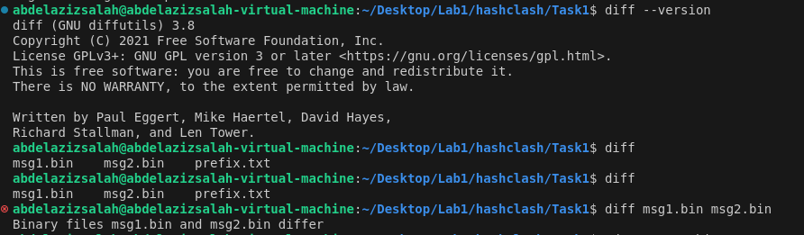
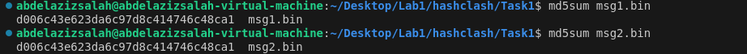
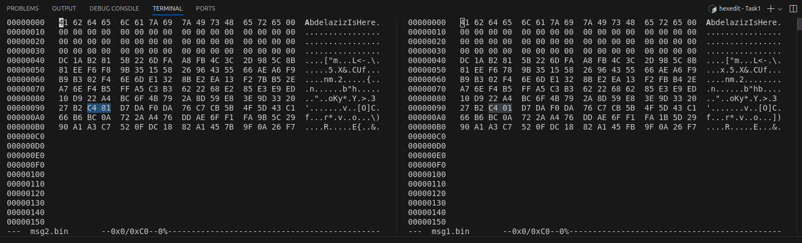
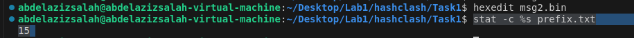
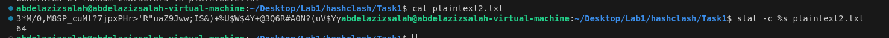
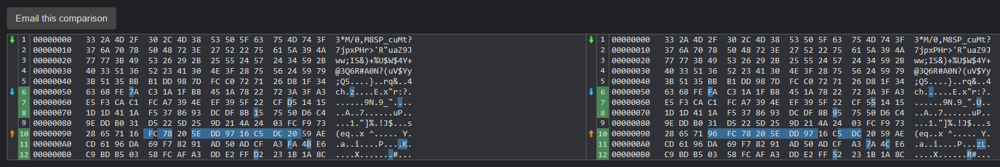
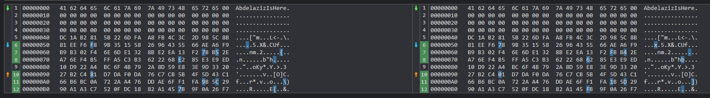
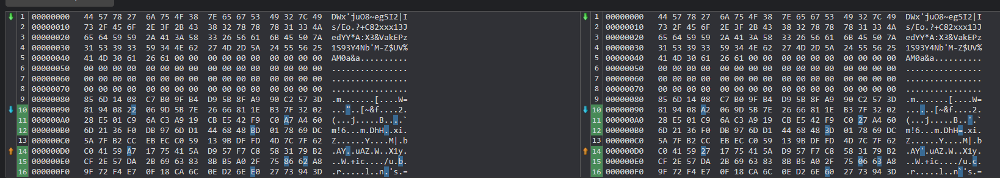

# MD5 Collision Attack
* in this lab we will try to exploit the broken algorithm MD5 by generating two different files with the same Hash values.

## Installations
* Install [Hash Clash](https://github.com/cr-marcstevens/hashclash) 
* read the readme there to be able to understand how it works.

## Task1: Generating Two Different Files with the Same MD5 Hash
* first you need to build the hash clash using 
    > ./build.sh
* then you need to build all the functions there using
    > ./ make
* then you will find all the tools in the **bin folder**
* Now to generate two different files with the same MD5 hash value, you need to run this command:
    >  ./bin/md5_fastcoll -p prefix.txt -o msg1.bin msg2.bin
* this **prefix.txt** is normal file which can contiains any dummy data like "Hello I am Abdelaziz Neamatallah"
* then to check that the two generated files are different we can use the **diff tool**
    > diff msg1.bin msg2.bin
* you should see the following: 
    * 
* then to ensure that both have the same md5 value, use the **md5sum**
    > md5sum msg1.bin

    > md5sum msg2.bin
* you should see that both have the exact same output:
    * 
* opening both files we can see that they have the same prefix:
    * 
    
* now we have 4 questions to answer:
### Q1. what does this md5_fastcoll does and how it does it?
*
### Q2. What happens if the byte length of your prefix file is not a multiple of 64?
* First question to ask here, is how can we determine the byte length of our prefix file
* the answer for this can be done using this command:
    > stat -c %s prefix.txt
* or easily we know that each character is represented as one byte, so we can just count the number of characters inside it.
* for "AbdelazizIsHere" I have 15 characters there, which means 15 bytes, we can ensure this using our tool to get this result: 
    * 
* now to make it easier for us during doing our experiment, lets create a python script, which generate random characters based on the number we give and store it in a file called **prefix2.txt**
``` python
import random
import string

def generate_random_file(length):
    chars = string.ascii_letters + string.digits + string.punctuation
    random_text = ''.join(random.choices(chars, k=length))
    
    with open("prefix2.txt", "w") as f:
        f.write(random_text)

# Example: Ask the user for input length
if __name__ == "__main__":
    n = int(input("Enter number of characters to generate: "))
    generate_random_file(n)
    print(f"Generated {n} random characters in prefix2.txt")
```
* then lets generate a file contains 64 bytes and ensure the size using our magic command: 
    * 
* now lets see what is the difference between what happened when the size was 15, and when it was 64.
    1. case of 64 bytes
        * 
    2. case of 15 bytes
        * 
* So first observation is that when the size is less than 64 it just appended zeros after it till the size becomes 16 * 4 = 64 bytes, lets try to make a file with maybe 70 bytes and see what will happen
    3. case of 70 bytes
        * 
* again it appeded zeros till the size is 16 * 8 = 128 bytes
* so if the size is not multiple of 64, they append zeros till the size becomes a multiple of 64
### Q3. Create a prefix file that has exactly a length of 64 bytes and run the collision generation described above once more. Describe what happens.
* 
* I do not see something special rather than it just does not pad zeros.
* and there are some small differences between two files.
### Q4.  Is the data (128 bytes) generated by md5_fastcoll completely different for both output files? Please identify all the bytes that are different
* 
* from this output it is clearly that they are not completly different, they are almost the same


