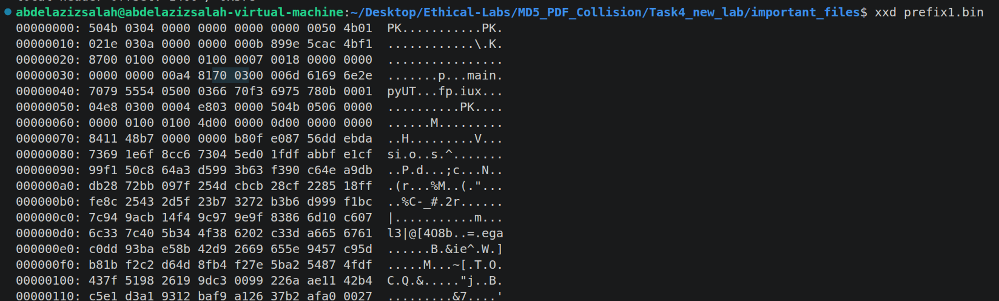

* The main goal of the task5 is to show that using MD5 digest for authenticating files is not a good idea. 
* So we want to zip a file with certain code good.py, and to send it to the server to sign it, then we get the signature, after that we utilize another zip with the same hash, and send it to the server, but with the evil content. 
* The steps are as follows: 
  1. We are given 2 prefix files, with the same hash, but different content. 
  2. since the suffix contains both data, the evil.py and good.py, so appending it to the both prefixes, will make the hash is also identical. 
  3. The important ZIP idea:
     1. Zip files follows certain structure:
        1. [local header] [file data] [Central directory][EOCD]
           1. Local header contains meta information about its file (i.e. a.txt meta information, CRC, length, and so on.)
           2. File data contains the actual data of a.txt
           3. Central directory contains location of each file.
           4. EOCD contains the location of the first Central directory. 
  4. What is the content of prefix1, prefix2, and suffix? 
     1. prefix1 contains meta information, stating that there is a file called main.py but exists in offset 0x370, so the unzip will go and read this content from this location. 
     2. prefix2 contains meta information, stating that there is a file called main.py, but exists in ofset 0x578.
     3. The suffix contains these both 2 main files. 
        1. Suffix.bin = padding until offset 0x370, local ZIP header for main.py, good main.py data, padding until offset 0x578, local ZIP header for main.py, evil main.py data. 
     4. good.zip = prefix1.bin + suffix.bin
     5. evil.zip = prefix2.bin + suffix.bin
     6. now due to the propery, we will end up with the same hash :)
  5. what is the purpose of parse_prefix.py? 
     1. To understand what the prefix files already contain as ZIP metadata
     2. It also shows where is the header offset of its main.py
     3. It looks for the EOCD which is marked as PK0506, and the central directory which is marked with PK0102
     4. Then it extracts the offset of the main.py
        1. 
     5. Logic:
        1. It reads all data as raw bytes
        2. looks for the central directory
        3. looks for EOCD
        4. Extracts important fields which are: 
           1. CRC which is the checksum of size 32-bit stored for each file to detect accidental corruption => it is located 16 bytes after the location of Central directory => tell them to find it in the hex format :) (0x87f14bac)
           2. Compression size => 20 bytes after Central directory (0100) in hex, this is 16^3 * 0, 16^2 * 1, 16^1 * 0, 16^0 * 0 = 256
           3. Uncompressed size => 24 bytes after Central directory (0100) = 256 also
           4. File name length 28 bytes after CD (07)
           5. Local offset of the file 42 bytes after the CD => 0x0578
 1. How did we manage to know the locations 0x370, 0x578?
     1. from the central directory of prefix1.bin, and prefix2.bin
 2. What is the purpose of crc_clash.py
    1. Given original file and the target CRC32
    2. It appends a suffix, so that the final CRC32 becomes equal to the target
    3. Why is it possible to collide the crc? 
       1. because it is not cryptographic, it is linear, so, it is possible to keep appending data until we the target CRC. 
       2. Also it is only 32 bits, which is 4 bytes, so it just needs to control only 32 bits
       3. So it uses linear algebra:
          1. matrix * patch_bits = needed_crc_differecnce
       4.  It is linear over GF(2), so combining path bits is just XORing their effect
       5.  So it computes the patch_bits using the inverse. 
 3. What is the purpose of build_zips.py:
    1. Build the shared suffix nd create the final colliding ZIP files
    2. It uses the information discovered by parse_prefix.py
    3. It creates valid ZIP local file containg good and evil payload, and place them in the exact offsets
       1. good.zip = prefix1.bin + suffix
       2. evil.zip = prefix2.bin + suffix
 4. Finally we will get two zip files with the same hash :) 