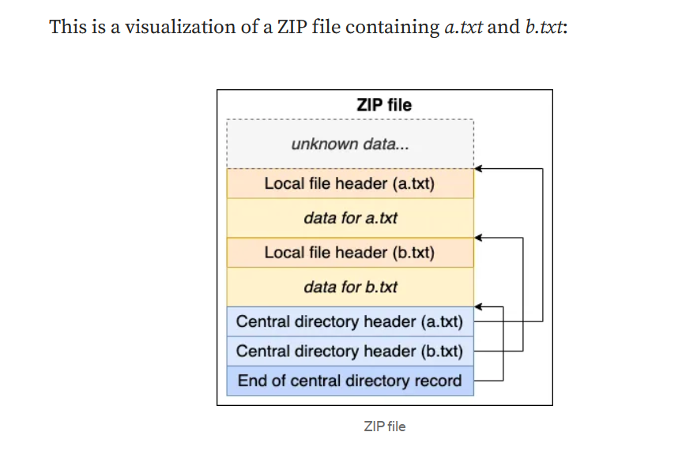

I need to create two zip files with the same md5 hash. 
One zipfile contains the good main, while the other contains the evil main. 
Next, I need to make the signing endpoint to sign one of our zip files. 
Then I will utilize the recieved hash to send the second zip file with the malicious main. 

1. I should use hashclash tool to make the same hash of the main programs. 
2. I need to understand how the zip file looks like.
    - For a zip containing a.txt and b.txt, it will look like thisS
        
    - So you need to know that it consists of 3 main parts: 
        - Local file header: Contains meta data about a single file and is followed by the file data. Each file can be handled independently. 
        - Central directory file header: Contains metadata about a single file and an offset to the localfile header for that file, a list of these headers forms the Central directory which cn be used to quickly enumerate all files in the archive. 
        - End of central directory record: Contains information on where to find the first central directory file header. 
    - So, it can be seen that if I managed to create one zip file with the two main functions, but in the first.zip I changed the End of central directory to show only the good.main, and the second zip to show only the evil.main, then I can make the signing function sign the same zip file for me, and give me valid signature for both. 
    - Since both of them have the same content, then the hash of them should be the same. 

3. Inspecting ZIP signature
    - xxd -g 1 prefix1.bin 
    - xxd -g 1 prefix2.bin 
    > We should notice the 50 4b 03 04 for the local file header.
    > and 50 4b 01 02 for central directory file.
    > and 50 4b 05 06 for end of central directory. 
    > We can see the CRC bytes at the end of address 0x10 as 0x87f14bac
    > Local header offset is 0x0370

4. Crafting payload
5. Then building the zip
6. Then submit the good one to the signing service, and get the .md5 signature
7. make another folder with the evil.zip along with the given .md5 signature
8. submit it to the service, and then extract the flag: CTF {secret-9g11n3PYRYVd8u2L5SvX}