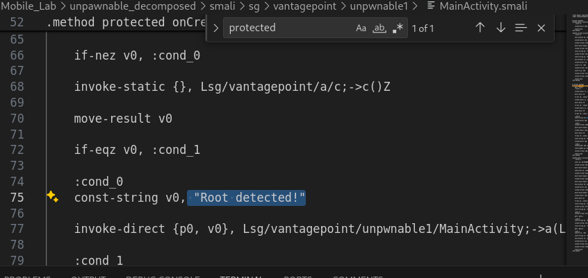

# Possilbe questions
- I have analyzed and solved the lab on kali machine, check EthicalLabs/MobileLab
- What is Jadx/ or any other tool used to generate the java files out of the apk.
  - It is a decompiler for android apps
  - It takes an APK file and converts it to its compiled code, mainly DEX bytecode, back into readable JAVA-like source code. 
  - We need it because we can not read the content of files from APK, but we also need to perform static-analysis on the code to extract useful information.
- How did you know that the given secret is base64 encoded, and also how did you know that the secret is encrypted using AES and ECB mode. 
  - Base64 usually ends with = sign
  - AES and ECB are mentioned in a.java file in the SecretKeySpec
- What is PKCS7Padding?
  - It is a padding method used in block ciphers like AES when data length is not exactly a multiple of block size.
  - It adds the number of missing bytes in hex, i,e if 3 bytes are missing it will add:
    - 03 03 03 
  - if 5 are missing:
    - 05 05 05 05 05
- What is the difference between AES and ECB?
  - AES is the symmetric encryption algorithm which is used to convert the plaintext to ciphertext.
  - ECB is the mode of operation, how do we perform the AES on the long size input specially if the input has size larger than the input block size. 
  - So, if the AES has input block size of 16bytes, and the input was 30 bytes, the input is splitted into 2 blocks each of size 16, and the last block is padded to fit the 16 bytes size, then the mode of operations decides how we will perform the AES on each block, whether we will append the output of previous block to the input of the next block, or each block will be performed independently and so on.
- How did you know that this is the key?
  - It is 32 characters, and on analyzing the java files, we found that the b function in unpawnable1/a.java converts the input to byte array, and then send it to function a in a/a.java as bArr, which on analyzing it we will find that it is defined as the SecretKeySpec. 
- Why do we divide the length by 2 in the function b in file a.java
  - 1 byte is 8 bits, and 1 hexchar is 4 bits, that is why we divide the length by 2
- Explain the function a in file a/a.java
```java

    public static byte[] a(byte[] bArr, byte[] bArr2) throws NoSuchPaddingException, NoSuchAlgorithmException, InvalidKeyException {
        '''
            This function is doing AES decryption
            bArr is the AES key
            bArr2 is the data
            it returns the decrypted data as plaintext
        '''
        
        // Creating a key object from bArr in AES algorithm using ECB mode with PKCS7 padding method
        SecretKeySpec secretKeySpec = new SecretKeySpec(bArr, "AES/ECB/PKCS7Padding");

        // Creating AES cipher object
        Cipher cipher = Cipher.getInstance("AES");

        // 2 means decrypt mode
        cipher.init(2, secretKeySpec);

        // doFinal performs the decryption
        return cipher.doFinal(bArr2);
    }
```
- What is apktool, why we need it, and how does it perform its job?
  - It is a reverse-engineering tool for andriod APK files.
  - It is mainly used to decode APK into editable files, especially smali code
  - We need it because Jadx is used to read the Java-like code, but apktool is better for modifing and repackaging the apk. 
  - We use it to create the smali code files, then we edit the file that we want, then we rebuild the apk again, then we need to sign it using jarsigner. 
  - Smali code is a human-readable form of Andriod bytecode. Andriod apps usually written in Java or Kotlin, then compiled into .dex files inside the APK. The Apktool converts these .dex files into smali files, so we can read and edit the low-level app logic.
- How did we know that .method protected onCreate() is the function we are looking for and we need to modify it to bypass the protection?
  1. It runs inside the onCreate, so it executes when the app starts
  2. It calls boolean security-check method known from the Z symbol.
  3. It branches based on the result.
  4. The branch leads directly to the strings like "Root detected!" 
     1. 
     2. unpwnable1/MainActivity.smali