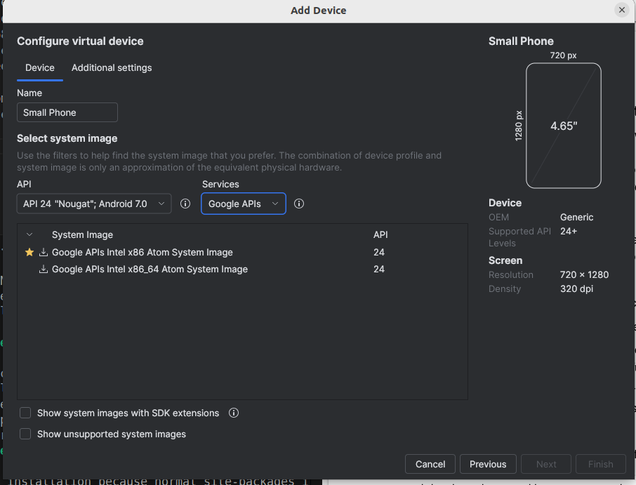
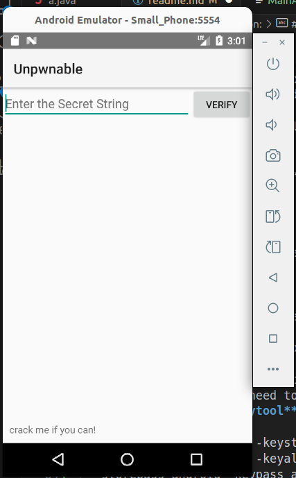
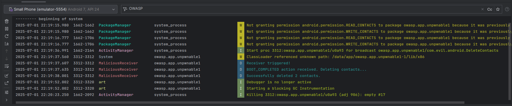

# Solution: 

## Task2 
1. the secret is: **I want to believe**
2. we got it using the script **./Mobile_Lab/decryption.py**
3. I generated readable files using jadx
    > jadx -d jadx_out Unpawnable.apk
4. then examining the files, I found that it uses AES as encryption scheme, and the used key is stored there which is: 
    - 8d127684cbc37c17616d806cf50473cc
5. and the secret key is encoded using base64, and encrypted with the key
    - 5UJiFctbmgbDoLXmpL12mkno8HT4Lv8dlat8FxR2GOc=
6. so I wrote the script to decrypt it. 

## Task3: 
* Installing a new device with API version 24, I got this screenshot: 
    - 
* now I should try to remove the protection mechanism
1. Decompressing the apk with apktool
    > apktool d Unpwnable.apk -o unpawnable_decomposed
2. Identify the sections responsible for the altered program behaviour on rooted device

            # virtual methods
            .method protected onCreate(Landroid/os/Bundle;)V
                .locals 1

                invoke-static {}, Lsg/vantagepoint/a/c;->a()Z

                move-result v0

                if-nez v0, :cond_0

                invoke-static {}, Lsg/vantagepoint/a/c;->b()Z

                move-result v0

                if-nez v0, :cond_0

                invoke-static {}, Lsg/vantagepoint/a/c;->c()Z

                move-result v0

                if-eqz v0, :cond_1

                :cond_0
                const-string v0, "Root detected!"

                invoke-direct {p0, v0}, Lsg/vantagepoint/unpwnable1/MainActivity;->a(Ljava/lang/String;)V

                :cond_1
                invoke-virtual {p0}, Lsg/vantagepoint/unpwnable1/MainActivity;->getApplicationContext()Landroid/content/Context;

                move-result-object v0

                invoke-static {v0}, Lsg/vantagepoint/a/b;->a(Landroid/content/Context;)Z

                move-result v0

                if-eqz v0, :cond_2

                const-string v0, "App is debuggable!"

                invoke-direct {p0, v0}, Lsg/vantagepoint/unpwnable1/MainActivity;->a(Ljava/lang/String;)V

                :cond_2
                invoke-super {p0, p1}, Landroid/app/Activity;->onCreate(Landroid/os/Bundle;)V

                const/high16 p1, 0x7f030000

                invoke-virtual {p0, p1}, Lsg/vantagepoint/unpwnable1/MainActivity;->setContentView(I)V

                return-void
            .end method

* this is where the check happens
* to bypass the conditions, we just need to add this command at the begining of the function
    > goto :cond_1
* then we need to save the file and rebuild the apk using this command: 
    > apktool b unpwnable1_decompiled -o unpwnable1_patched.apk

* then when we try to upload it over the phone, we will see error message stating that we need to sign the apk
* so we need to use **keytool** to generate a keystore and sign the apk using this command: 
    > keytool -genkey -v -keystore ~/.android/debug.keystore \
  -alias androiddebugkey -keyalg RSA -keysize 2048 -validity 10000 \
  -storepass android -keypass android \
  -dname "CN=Android Debug,O=Android,C=US"

* then we can use jarsigner to sign the apk
    > jarsigner -verbose -sigalg SHA1withRSA -digestalg SHA1  -keystore ~/.android/debug.keystore   -storepass android -keypass android  unpwnable1_patched.apk androiddebugkey

* when it ask for the password, enter: **android**
* then you can open the app and see that we bypassed the condition and no error message appears:
    - 

## Task4: 
1. create java file, and add DeleteContacts.java
2. modify the Manifest file
3. compile it using android studio
4. copy the smali file into the unpawable_decomposed
5. rebuild the modified apk
    > apktool b decomposed -o delete_contact.apk
6. sign the apk
    > jarsigner -verbose -sigalg SHA1withRSA -digestalg SHA1  -keystore /home/abdelazizsalah/Desktop/Ethical-Labs/Mobile_Lab/my-release-key.keystore   -storepass android -keypass android  malicious.apk alias_name
7. uninstall the previous apk
8. install the new apkS
9. open logcat from android studio, you can see the log
    - 
10. you can see that the contacts are deleted.

* To reboot the mobile
    > adb reboot
* To insert the apk
    > adb install **apkName**