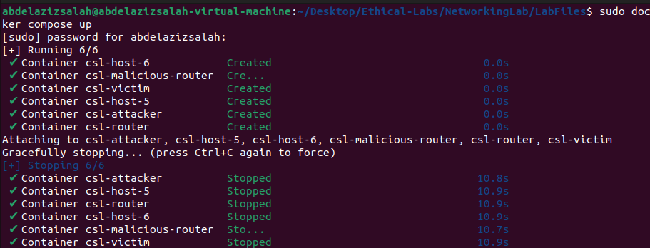
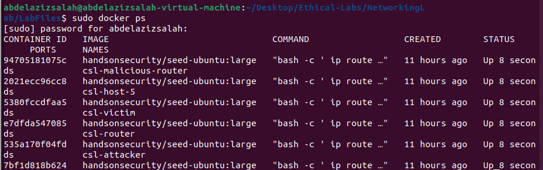
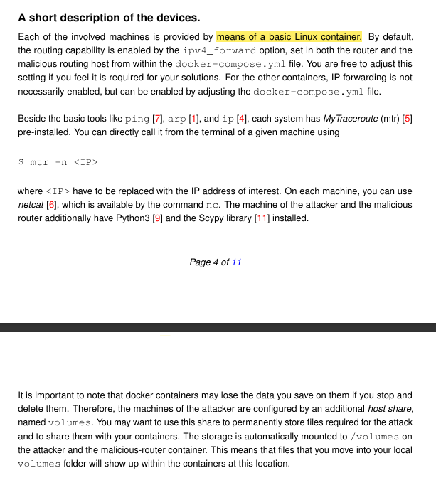
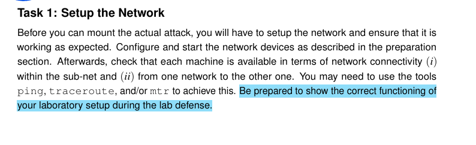
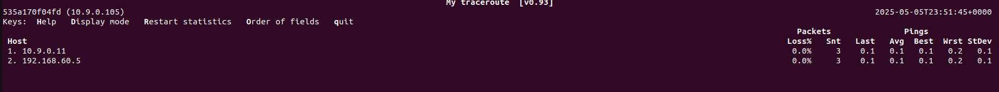
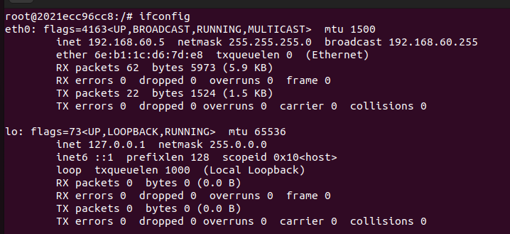
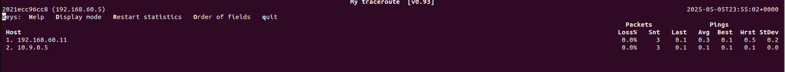
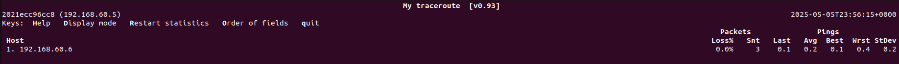

# ICMP Redirect Attacks
* In this Lab we need to understand what does ICMP Redirect Messages are, and how they can be used to perform Man-in-the-middle (MITM) attacks.
  
## What does ICMP mean?
* ICMP stands for internet control message protocol
### Purpose and Use:
* ICMP is used for sending error messages and operational information indicating success or failure when communicating with another IP address.
* It is a supporting protocol in the Internet protocol suite and is mainly used for: 
  * Error reporting
  * Network diagnostic (e.g. using **ping** and **traceroute**)
  * Control Messages such as **ICMP Redirect** which is our interest here in this lab, which tells a host to update its routing information to use a better path. 

## What are ICMP Redirect Messages in more details?
* Usually in Networks we have 2 levels of communication
  * Local Area Network: in which all devices are usually connecting with single switch
  * Large Scale Networks: in which we divide the Network into muliple clusters, each cluster is called **sub-net**. these **sub-nets** are connected together using routers. 
* when one device in one sub-net needs to send data to another device in different sub-net, it sends them through routers. 
* in some cases the routers in the path find that there are better pathes in the network in which the data can be sent through, so instead of recieving data and be overwhelmed with far away data, it send **ICMP Redirect Message** to the source device, telling it to send his packets through **The Faster and closer router**.

## MITM Attack
* Now as you can guess, the problem is that attacker can exploit such protocol to spoof a message, and tell the client that his device is a **Faster and Closer router**, and force him to send all his packets through his device, so he can be a man in the middle
* 

## Overview of the network topology

* Our network is divided into 2 subnets
1. Local network:
   * its IP is: **10.9.0.0/24**
   * its mask is 24, this mean that 10.9.0.x are the ips of possible hosts, meaning that we have 2^8 possible hosts = 256 possible hosts - 2 = 254 possible hosts.
   * because 10.9.0.0 and 10.9.0.255 are reserved 
     * 10.9.0.0 -> network address
     * 10.9.0.255 -> broadcast address
   * it contains:
     * the Victim: **10.9.0.5**
     * Hacker (**Mallory**): **10.9.0.105**
     * Malicious Router: **10.9.0.111**
2. Remote network: 
   * its IP is: **192.168.60.0/24**
   * it contains two servers: 
     * server1: **192.168.60.5**
     * server2: **192.168.60.6**
3. the true router
   1. it contains 2 interfaces
      1. local network interface: **10.9.0.11**
      2. remote network interface: **192.168.60.11**
   2. its main role to connect the two networks together.

## Setting up the Network devices

### What is docker? 
* Before we start we need to briefly explain what is docker and why we use it?
* **Docker** is an oper-source platform that allows us to automate deployment, scaling and management of applications using containers.

### What is container
* a container is a lightweight, standalone, and excutable unit that includes:
  * the application code
  * system tools
  * libraries
  * Dependencies
* Everything the software needs to run - **without worrying about differences between enviroments ie: laptop versions, different software versions, and so on.**

### Why do we use Docker? 
* **Consistency Across Environments**: "It works on my machine" is no longer a problem — containers run the same everywhere.

* **Isolation**: Each container runs in its own isolated environment, reducing conflicts.

* **Lightweight**: Containers share the host OS kernel, making them faster and less resource-intensive than full virtual machines.

* **Portability**: Containers can run on any system that supports Docker (Linux, Windows, macOS).

* **Efficiency in Deployment and Testing**: Perfect for labs like yours — you can set up a full network of virtual machines (routers, clients, attackers) in seconds using docker-compose.

* **Version Control**: Docker images can be versioned just like code, making rollback or testing older versions easy.

### In our lab?
* Docker is used to simulate a complete network setup without needing of multiple physical or virtual machines, which makes the experiment much easier and cleaner.
  

## Setting up the lab
1. Navigate to the folder in which you installed **docker-compose.yml**
2. ensure you have docker-compose using this command
    > docker-compose --version
3. if not, install it using these commands:
    > mkdir -p ~/.docker/cli-plugins

    > curl -SL https://github.com/docker/compose/releases/latest/download/docker-compose-linux-x86_64 -o ~/.docker/cli-plugins/docker-compose

    > sudo mkdir -p /usr/local/lib/docker/cli-plugins

    > sudo mv ~/.docker/cli-plugins/docker-compose /usr/local/lib/docker/cli-plugins/

    > sudo chmod +x /usr/local/lib/docker/cli-plugins/docker-compose

    > sudo docker compose version
4. run this command to build the lab:
    > sudo docker compose up
    > 
5. try in another terminal to check for the existing processes
    > sudo docker ps
    
> ! It is recomended not to work on Kali linux but to work on Ubuntu, because there are some conflicts which may face you on kali

6. if you want to stop the infrastructure, just press **CRRL + C** in the first terminal from which you run **sudo docker compose up**
  

## Working with devices
1. we can execute some commands on certain device using this command
   >  docker exec-it (container-id) (command)
2. so we can get a bash on the attacker machine for example using this command:
   >  sudo docker exec -it 535a170f04fd bash
    

## Short description about the devices

* all machines are implemented using basic Linux containers. 
* **Routing** capability is enabled by **ipv4_forward**

### What is **ipv4_forward**
* it is a feature in operating systems that allows a machine like **router** to pass network packets from one network interface to another **ie: forwarding packets which are not meant for itself**
* for example:
  * if computer has 2 network interfaces eth0, and eth1.
  * if IP forwarding is enabled, computer can forward packets recieved on **eth0** to **eth1**
#### Why this is important? 
* because in our lab the main router and the malicious router need to forward traffic between subnets. 
* that is why IP forwarding should be enabled to them in the **docker-compose.yml** file. 
  
### How to check them on linux machines? 
> cat /proc/sys/net/ipv4/ip_forward
> 

* when you see 1, this mean it is active. 

### What is mtr? 
* it stands for **my traceroute**. 
* it is a network diagnostic toll that combines the functionality of:
  * ping: shows if a host is reachable
  * traceroute: shows the path packets take through the network

#### What does it do? 
* it shows us: 
  * All the routers our packet travels to reach the destination
  * How much delay each hop introduces
  * if there is any packet loss at specific hop
#### why to use it? 
* it helps us in analyzing problems like: 
  * slow connections
  * broken routing
  * packet loss
  * testing if the routing setup works well
  * how packetss are being forwarded.
#### How to use it? 
> mtr -n (IP address)

* now lets go and solve the Lab Tasks :)

 

## Tasks

### Task1: 

1. Now I will connect to the attacker machine, and try to ping all other devices to ensure that they are up

* Now we can see that all of them responded.
  
2. Now lets check the routes.
   1. the Victim **10.9.0.5**
      *  
      * we can see that we do not have intermediate routers, because we are on the same subnet
    2. Server1 **192.168.60.5**  
       *  
       * we can see the intermediate router ip: **10.9.0.11**
    3. Server1 **192.168.60.6**  
       *  
       * we can see the intermediate router ip: **10.9.0.11**
3. lets check the routes from the server side, server1 for example.
   
4. now lets check routes: 
   1. The Victim: 
      * 
      * we can see we have intermediate router which is 192.168.60.11 as expected
   2. The Attacker: 
      * 
      * we can see we have intermediate router which is 192.168.60.11 as expected
   3. Server2: 
      * 
* TASK1 Done

### Task2: 
* 