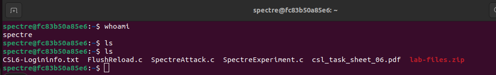
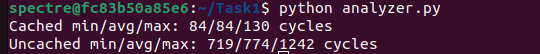
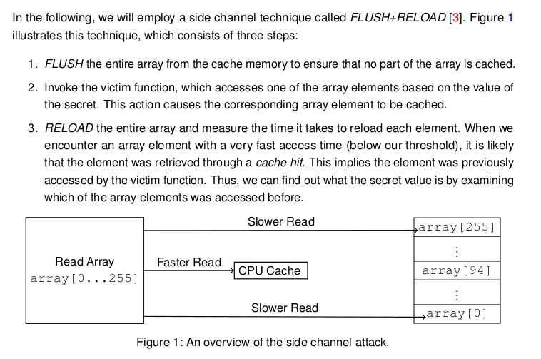
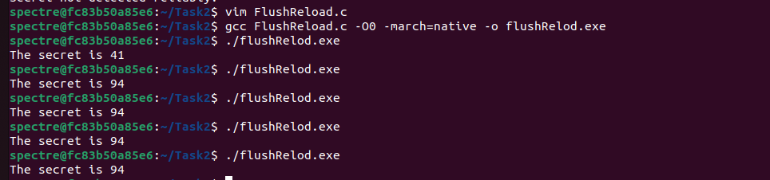

# The Spectre Vulnerability

## 🎯 Lab Objective
The goal of this lab is to understand and exploit the **Spectre vulnerability**, which affects speculative execution in modern CPUs. We will perform a real-world attack scenario where protected memory is leaked using a **side-channel technique (Flush+Reload).**

---

## 🔑 Key Concepts
- **Speculative Execution:** Modern CPUs execute instructions before they are verified, which can lead to leaking data.
- **Cache Timing Attacks:** Different access times for cache hits and misses reveal information.
- **Flush+Reload:** A side-channel technique used to detect if certain memory locations have been accessed.

---

## 🛠️ Lab Tasks Overview
### Task 1: Measure Cache Timing
- Analyze the timing difference between cache hits and misses.
- Identify a threshold to distinguish between them.

### Task 2: Cache as a Side Channel
- Use Flush+Reload to leak a one-byte secret from a victim function.

### Task 3: Understand Speculative Execution
- Learn how out-of-order execution affects memory access.

### Task 4: Demonstrate Spectre
- Use speculative execution to leak a secret in controlled conditions.

### Task 5: Implement the Spectre Attack
- Leak the first character of a protected secret using speculative execution and a side-channel.

### Task 6: Improve Attack Accuracy
- Automate multiple runs and improve reliability of the attack.

### Task 7: Steal the Full Secret
- Extend the attack to leak an entire secret string from memory.

---

## ⚙️ Environment Setup
- Use the **provided remote VM** (local machines might behave differently).
- and copy all files to the machine
- Recommended compilation flags:
  >   gcc myprog.c -O0 -march=native -o myprog
- 

## Task1
* In this task, we will investigate how the CPU cache affects memory access times by writing a C program to measure the time it takes to read a one-byte variable in two cases: when the data is cached (cache hit) and when it is not cached (cache miss). We will use low-level instructions like `_mm_clflush()` to flush the cache and `__rdtscp()` to accurately measure CPU cycles. By running the experiment multiple times (at least 100), we will analyze the timing results to identify a clear threshold that distinguishes between cache hits and misses. This threshold will later be used as the foundation for detecting cache-based side-channel activity in subsequent tasks.
* so I wrote the code you can find in **./Task1/time_evaluation.c**
* and I wrote another code to analyze the outcome results you can find it at **./Task1/analyzer.py**:
    - 
* we can see that the maximum time needed for cached version is 130 cycles, while the minimum time needed for uncached version is 719
* this mean that we can give a threshold 250 for example, if the cycles are less than it, we consider this as cache hit, otherwise it is a cache miss.

## Task2
* In this task, we will apply the FLUSH+RELOAD technique to leak a secret value from a victim function using the CPU cache as a side channel. The victim function accesses an element of an array based on a secret one-byte value, and our goal is to figure out which element was accessed without directly reading the secret. We will flush the entire array from the cache, invoke the victim function to cause a cache access, and then reload each array element while measuring the access time. The element that is accessed faster (cache hit) reveals the secret value. This task demonstrates how attackers can indirectly observe sensitive information through microarchitectural side effects like cache behavior.
    - 
* On implementing the flush and reload code which you can find at **./Task2/FlushReload.c**
- we will see that we can get the secret which is **94**
* 

## Task3 (Theoritical)
* Since the CPU has two options:
    1. if correct: the speculative execution is committed and we gain performance gain.
    2. otherwise: we revert back all the executed commands, and the execution is discarded
* we can see the difference, that in case of wrong assumption there will be more time consumption, due to the reverting process, which can be seen in the trace.
* also the values which are executed during the guess will change, even if the execution is later discarded.
* this can be useful by using Flush+Reload, an attacker can detect what data was speculatively accessed and reconstruct the secret information

## Task4 
* In this task, we will implement and observe speculative execution in action. Using a provided `SpectreExperiment.c` skeleton, we will combine our earlier Flush+Reload side-channel code with speculative execution. The victim function will contain a bounds check (e.g., `if (x < size)`) before accessing an array. However, through repeated training of the CPU branch predictor with valid inputs, we will trick the CPU into speculatively executing the memory access with an out-of-bounds index. This will load secret data into the cache. By measuring the cache access times afterward, we will confirm whether speculative execution leaked the secret into the cache. The task also asks we to experiment with changing parts of the code to observe how the speculative behavior changes and how the CPU’s branch predictor affects the success of the attack.