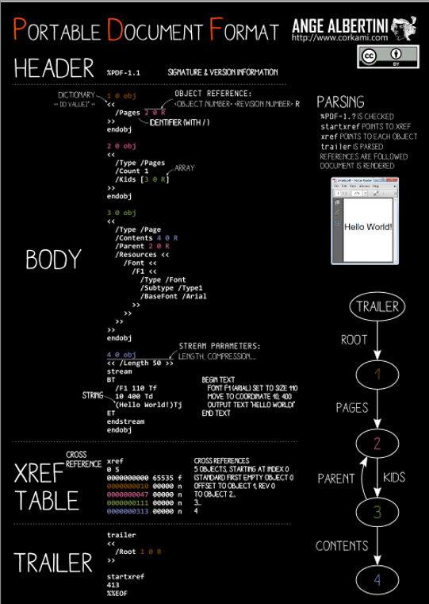
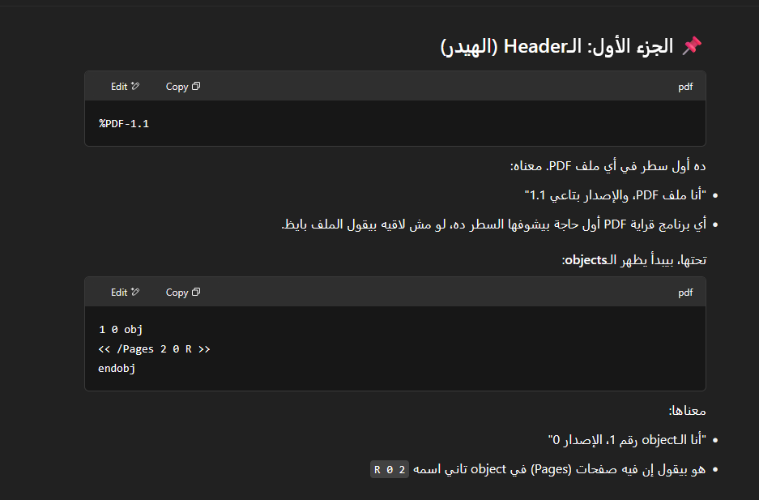
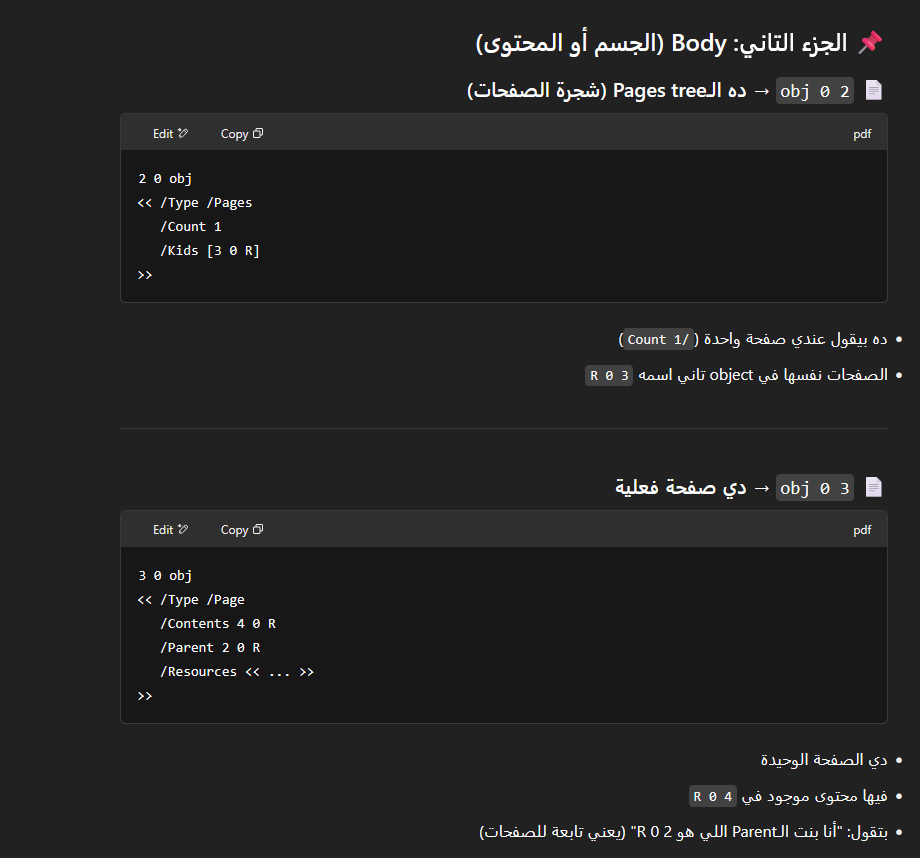
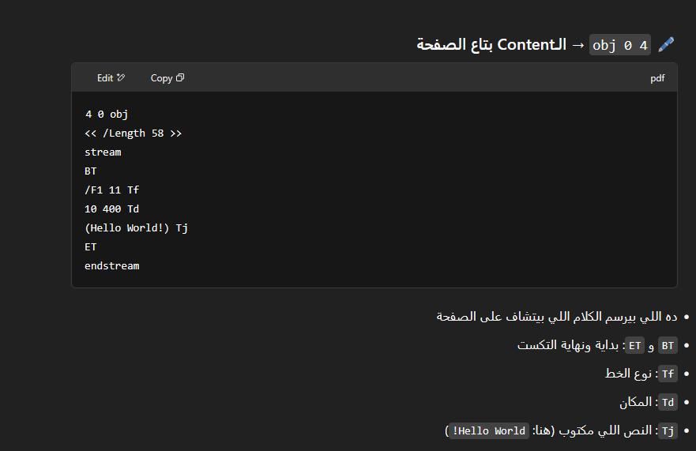
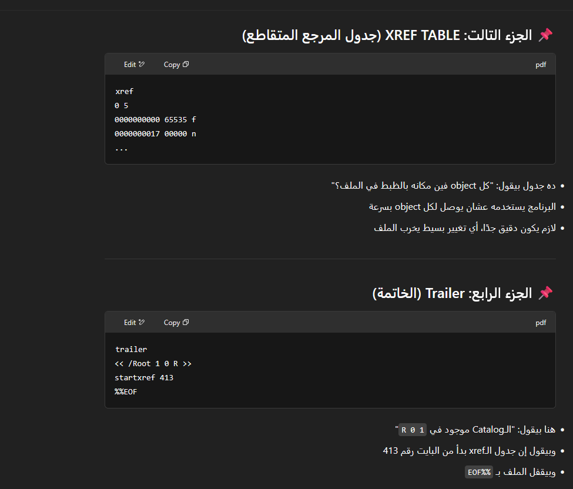
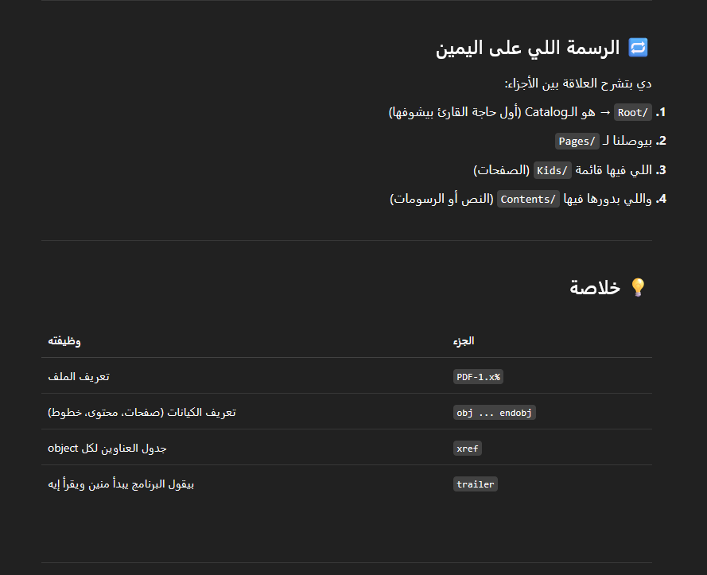

# General Structure of pdf

## Explaination

* el ana 3auz a3mlo bzbt: 
  1. ana h3ml crafting lel header, so that, el pdf el awl hy3ml show le awl pdf
  2. w h3ml crafting lel header el tany b7es eno y3ml show lel pdf el tany
  3. ast5dm el cpc 34an ytl3ly binaries lkol wahed fehom mo5tlf, which will be used bl python script 34an atl3 el data de 

* Generated successfully, the problem was that I am using wrong dummy pdf