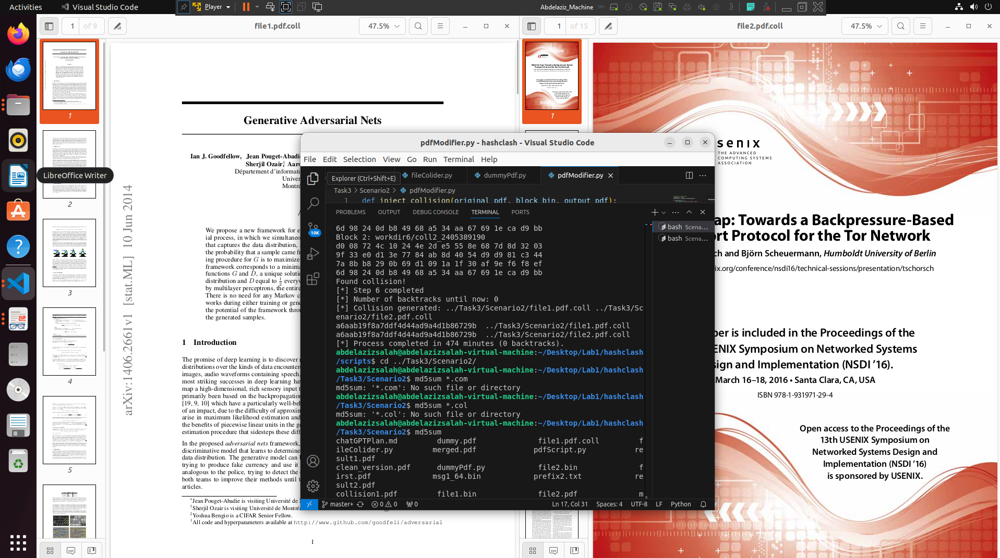

# using the hashclash tool
* on running this command the tool generated for me two pdfs with the same md5sum 
    > ./cpc.sh ../Task3/Scenario2/file1.pdf ../Task3/Scenario2/file2.pdf 
* 
* which is choosen prefix collision.